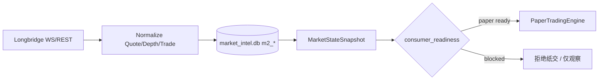
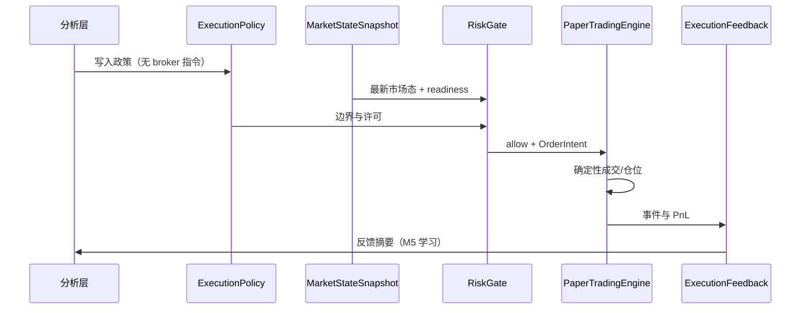

# Brief: M4 引导式纸交探索 & M2 深度/逐笔补齐

> 读者：产品 / 工程对齐用。说明「这两项在干什么」，对照**今天仓库里已有**与**路线图待做**。
> 日期：2026-06-06

## 一句话

| 项 | 在干什么 |
|---|---|
| **M2 深度/逐笔补齐** | 让**真实行情管道**持续产出盘口 + 成交逐笔，使系统敢说「纸交仿真可以开」(`paper_simulation: ready`)。 |
| **M4 引导式纸交探索** | 把 **分析结论** 按固定流水线送进 **风控闸门 → 纸交引擎 → 执行反馈**，在**批准的机会/风险边界内**做局部仿真，而不是 AI 直接下单。 |

二者关系：**M2 提供「市场事实」；M3 提供「仿真成交」；M4 提供「谁允许、在什么边界里、跑完后学到什么」。**

---

## 系统分层（上下文）

```text
┌─────────────────────────────────────────────────────────────┐
│  AI 分析层（LangGraph：Decision / Insight / Alpha 等）       │
│  产出：OpportunityMap, RiskEnvelope, ExplorationPlan,       │
│         ExecutionPolicy（M1 契约：不能含 broker 下单语义）    │
└───────────────────────────┬─────────────────────────────────┘
                            │  typed artifacts（artifact ID）
┌───────────────────────────▼─────────────────────────────────┐
│  执行仿真层（M2–M5，非 LLM 图）                                │
│  M2 LiveMarketDataPlane  → 只读行情事实                        │
│  M3 PaperTradingEngine   → 确定性纸交成交/仓位                 │
│  M4 串联 + RiskGate      → 政策内探索                          │
│  M5 ExecutionFeedback    → 反馈回分析                            │
└─────────────────────────────────────────────────────────────┘
```

**原则：** AI 只给「机会、风险、约束、是否允许纸交探索」；**能不能形成 OrderIntent、是否放行、如何成交** 由确定性组件决定。

---

## 一、M2 深度/逐笔补齐 — 具体在干嘛？

### 目标

`LiveMarketDataPlane` 不只「有一个最新价」，而是具备 **Quote + OrderBook（深度）+ Trade（逐笔）**，并能写入 `MarketStateSnapshot`，附带 **`consumer_readiness`**。

### `consumer_readiness` 是什么？

每个标的的快照上挂三档「谁可以用这份市场态」：

| 字段 | 含义（简化） |
|---|---|
| `analysis_monitoring` | 分析/监控：报价超过 5s 警告，超过 30s 阻断 |
| `paper_simulation` | **纸交仿真**：报价超过 2s **或** 缺深度 **或** 缺逐笔 → **blocked** |
| `source_mode` | `live` / `replay` / `degraded`（非 live 不能冒充 live） |

规则实现在：`apps/trader-agent/backend/app/modules/live_market_plane/readiness.py`（对齐 T016 D506）。

### 今天仓库里有什么 / 缺什么

| 能力 | 今天（v0） | 补齐后（待做） |
|---|---|---|
| REST 拉一条 quote | ✅ `POST /api/market-plane/ingest/{symbol}` | 保留 |
| Longbridge **WebSocket** Quote/Depth/Trade 推送 | ✅ 骨架已有（`longbridge_stream.py`） | 生产级：重连、持久化 depth/trade 表、监控 |
| 归一化 `OrderBookSnapshot` / `TradeTick` | ⚠️ 推送里合并进 quote 行，**未单独落库** | 独立 artifact + 可追溯 |
| live 路径 `paper_simulation: ready` | ❌ 常因 `depth_unavailable` / `trade_tape_unavailable` 被挡 | 有真实 depth+trade 且延迟 <2s → **ready** |

### 用户可见行为（补齐前 vs 后）

**前：** 你开了 WS，只有 Last/Bid/Ask 在变；纸交 API 仍可能返回「`paper_simulation blocked`」。

**后：** 同一 `TSLA.US` 的 `MarketStateSnapshot` 显示 depth/trade 质量旗标干净，`paper_simulation: ready`；M3 的 `POST /api/paper-trading/intents` 才允许用**这份**快照做仿真成交。



---

## 二、M4 引导式纸交探索 — 具体在干嘛？

### 目标

不是新做一个「会下单的 LangGraph」，而是把 **M1 的四个分析 artifact** 和 **M2 市场态 + M3 纸交** 串成一条**可审计、可复现**的管道：

```text
ExecutionPolicy → RiskGate → PaperTradingEngine → ExecutionFeedback
```

### 链上每一步「实际做什么」

| 步骤 | 谁 | 输入 | 输出 / 行为 |
|---|---|---|---|
| **1. ExecutionPolicy** | 分析层（AI 产出，M1 契约校验） | OpportunityMap、RiskEnvelope、ExplorationPlan | 「允许的模式」：如仅 `observe`、或 `paper_simulation`；**禁止** live/broker；含有效期、标的范围、最大名义等**约束字段** |
| **2. RiskGate** | **确定性**规则引擎（M4 待建） | ExecutionPolicy + 当前 MarketStateSnapshot + 账户/仓位快照 | **RiskDecision**：`allow` / `reject` / `reduce`；理由可审计；**LLM 不能否决** |
| **3. PaperTradingEngine** | 确定性仿真（**M3 已有 v0**） | 通过闸门的 OrderIntent + 引用 `market_state_snapshot_id` | OrderEvent（成交）、PositionSnapshot、PnL；同输入可重放 |
| **4. ExecutionFeedback** | 结构化报告（M4/M5 待建） | 上述事件 + 政策边界 | 「在政策内探索结果」：滑点、是否触及风险上限、可行性结论；供 M5 反哺分析/规则 |

### 与「AI 直接下单」的区别

```text
❌ 错误路径：LLM →「买入 100 股 TSLA」→ 券商

✅ M4 路径：
   LLM → ExecutionPolicy（「可在 TSLA 上做 paper，名义 < X，至 T+1」）
        → RiskGate（快照陈旧？越界？→ reject）
        → PaperTradingEngine（用快照价 + 滑点模型成交）
        → ExecutionFeedback（「这次探索说明什么」）
```

### 今天仓库里有什么 / M4 还要建什么

| 组件 | 状态 |
|---|---|
| M1 契约文档（四类 artifact + 禁止订单字段） | ✅ T014 |
| M2 行情 + WS 骨架 | ✅ T018 + stream |
| M3 纸交引擎 + API | ✅ T019 |
| **RiskGate** 模块 | ❌ 未实现 |
| **ExecutionFeedback** artifact + 存储 | ❌ 未实现 |
| **编排**：从 ExecutionPolicy 到一次完整探索 run | ❌ 未实现（可能 workflow 节点或 backend orchestrator，**不是**新 LLM 图） |
| LangGraph「PaperExplorationGraph」 | 📋 可选；路线图倾向 **能力串联** 而非再加一张图 |

### 一次 M4「探索 run」长什么样（目标态故事板）

1. 分析 run 结束，写出 `execution_policy_id=pol-xxx`（绑定某次 OpportunityMap / RiskEnvelope）。
2. 操作员或自动化触发「在 policy 内纸交探索」。
3. 系统拉取 **最新** `MarketStateSnapshot`；若 `paper_simulation` 非 ready → **整 run 失败可见**（依赖 M2 补齐）。
4. RiskGate 根据 policy 生成 0..N 条 **OrderIntent**（或拒绝并记录原因）。
5. PaperTradingEngine 逐条仿真成交，写入 `paper_*` 表。
6. 汇总为 **ExecutionFeedback**，链回 `insight_id` / `rule_candidate_id`（M5 用于评估与改进）。



---

## 三、两项如何一起工作

```text
没有 M2 ready ──► RiskGate / PaperTradingEngine 不应假装「live 探索」
有了 M2 ready ──► M4 才能在「真实延迟约束下」验证执行可行性
M4 产出 Feedback ──► M5 回答：是观点错了，还是规则边缘，还是根本成交不了
```

| 若只做其一 | 后果 |
|---|---|
| 只做 M4、不补 M2 | 纸交在**陈旧或缺深度**的快照上跑，反馈误导 |
| 只补 M2、不做 M4 | 有行情、能单笔纸交 API 测试，但**没有**「在政策边界内系统化探索」 |

---

## 四、与你已接入的 Longbridge 模拟盘的关系

| 能力 | 模拟盘 Token 作用 |
|---|---|
| Quote/Depth/Trade **WS** | 行情权限跟 App Key；模拟盘 token 可拉**真实市场推送**（与实盘同源行情） |
| 未来 Trade WS / 下单 | 交易权限跟 **Access Token**；模拟盘用于**仿真下单**，不进真券商 |
| M4 探索 | 仍走 **PaperTradingEngine（本地确定性）**；不是 Longbridge 模拟柜台下单，除非日后显式接 Trade API |

当前 M3 **不调用** Longbridge 下单接口；M4 目标态仍以 **本地纸交 + 政策闸门** 为主。

---

## 五、建议的下一步（工程顺序）

1. **M2 补齐**：WS 下稳定写入 `OrderBookSnapshot` / `TradeTick`；`paper_simulation` 在 live 下可 ready（验收：五个 US 标的快照 + readiness 字段）。
2. **M4a RiskGate v0**：读 ExecutionPolicy + MarketStateSnapshot → allow/reject + 审计日志。
3. **M4b Orchestrator**：一次「policy-bound paper run」API/CLI。
4. **M4c ExecutionFeedback v0**：结构化输出，挂到 evaluation / insight  handoff（衔接 M5）。

---

## 参考路径

| 主题 | 路径 |
|---|---|
| 路线图 M1–M7 | `project-docs/backlog/workflow-maturity-roadmap.md` |
| M1 契约 | `.agent-dev/specs/analysis-to-execution-contract-v0/spec.md` |
| M2 契约 | `.agent-dev/specs/live-market-data-plane-v0/spec.md` |
| M2 实现 | `apps/trader-agent/backend/app/modules/live_market_plane/` |
| M3 实现 | `apps/trader-agent/backend/app/modules/paper_trading/` |
| Readiness 规则 | `.../live_market_plane/readiness.py` |
