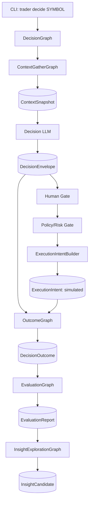
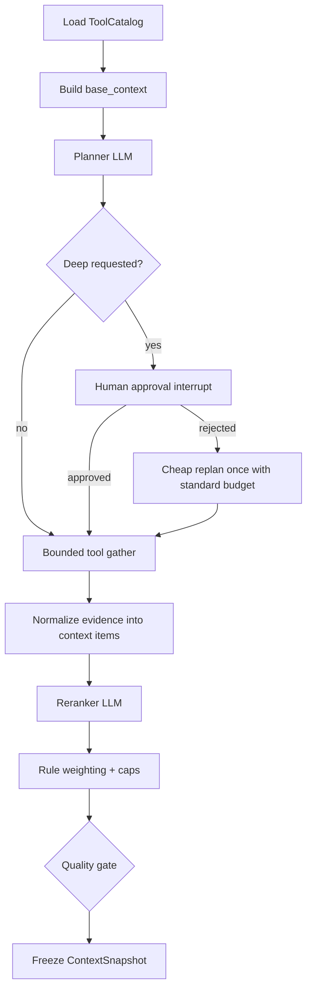

# T006 Workflow Design Note

Status: design note, candidate revision only
Date: 2026-06-02
Related task: `.agent-dev/tasks/T006.md`
Related spec: `.agent-dev/specs/self-evolving-agent-stage1/spec.md`

## Purpose

This note captures workflow design candidates discussed after the current T006 plan was produced.

It intentionally does not modify the active T006 spec, decision record, or slice files. Current task/spec artifacts remain the source of truth until selected decisions from this note are promoted through a T006 revision planning gate or a new task/spec.

Do not treat this note as worker-ready implementation scope.

## Core Direction

T006 remains an in-repo Stage 1 umbrella task.

```text
apps/trader-workflows
  LangGraph durable runtime + graphs + checkpoint store

apps/trader-agent/backend
  market_intel.db domain schema/API

apps/trader-cli
  thin command wrappers only
```

Minimum runnable unit:

```text
DecisionGraph(symbol)
```

Future fan-out workflows can call the same atomic unit:

```text
WatchlistBatchGraph -> DecisionGraph(symbol)*
EventTriggerGraph   -> DecisionGraph(symbol)*
```

## High-Level Workflow

Candidate revision diagram. It includes unpromoted concepts such as `ExecutionIntent`; use current T006 spec/task as the active contract until a revision is approved.



## Model Call Roles

Candidate revision principle: use one actual model initially, but record a role/profile field for each model call so future model swapping is cheap.

Candidate roles:

```text
context_planner
context_reranker
decision_writer
evaluation_summarizer
insight_explorer
```

Recommended call shape:

```ts
invokeModel({
  role: "context_planner",
  model_profile: "default",
  schema,
  input,
})
```

No separate model registry table is proposed for this candidate revision. If `model_call_traces` is promoted, store lightweight trace fields inside records such as `ContextSnapshot`, `DecisionEnvelope`, and `InsightCandidate`.

## ContextGatherGraph

`ContextGatherGraph` is a candidate naming/boundary for the context pipeline. Current T006 artifacts may still describe this area as `ContextSnapshot` pipeline; promote the graph name only after a revision decision.

If promoted, `ContextGatherGraph` is independent and is invoked by `DecisionGraph`.

It produces a frozen `ContextSnapshot`:

```text
base_context
llm_planned_context
final_weighted_context
context_quality_summary
gather_trace
model_call_traces
```

Important boundary:

```text
DecisionGraph consumes:
  final_weighted_context
  context_quality_summary

DecisionGraph does not consume:
  full gather_trace
```

`gather_trace` is audit/debug evidence only. Feeding the full trace into the decision model would waste context and leak low-quality intermediate reasoning into the final judgment.

### ContextGatherGraph Flow



## ToolCatalog Candidate

The model should not receive raw unlimited provider docs. A future revision can introduce a curated `ToolCatalog`.

Tool sources:

```text
Longbridge
Alpha Vantage
yfinance
local intel service
backend OpenAPI / Swagger
service list API
```

Maintenance policy:

```text
auto-generate from OpenAPI / CLI help / adapter metadata
then apply human allowlist
```

Tool rules:

- Read-only tools only during context gathering.
- No broker order tools.
- No direct database writes by LLM.
- No direct ContextSnapshot mutation by LLM.
- Tool use is budgeted and traceable.

## Budget And Deep Mode

Default mode is `standard`.

Suggested budgets:

```text
standard:
  planner_rounds <= 2
  tool_calls_total <= 8
  tool_calls_per_provider <= 4
  code_exec_calls <= 1
  runtime <= 90s
  final_context_items <= 40

deep:
  planner_rounds <= 3
  tool_calls_total <= 16
  tool_calls_per_provider <= 8
  code_exec_calls <= 2
  runtime <= 180s
  final_context_items <= 80
```

Deep mode can start in two ways:

```text
1. user explicitly passes --depth deep
2. planner requests deep and waits for human approval
```

If human rejects deep:

```text
reject_deep
-> cheap_replan_once
-> standard_continue
-> quality_gate
```

If promoted, the snapshot should record:

```json
{
  "deep_requested": true,
  "deep_approved": false,
  "deep_rejected": true,
  "cheap_replan_used": true
}
```

## Context Quality Gate Candidate

Use three levels if promoted in a revision:

```text
actionable
weak
insufficient
```

Decision behavior:

```text
actionable:
  full DecisionEnvelope allowed

weak:
  market judgment allowed
  trade action limited to WATCH / NO_TRADE

insufficient:
  no trade judgment
  persist NO_TRADE with decision_json.reason = INSUFFICIENT_EVIDENCE
```

If promoted, `weak` decisions still enter `OutcomeGraph` and `EvaluationGraph`, but they must be tagged with `context_quality=weak`.

Current T006 action enum is:

```text
NO_TRADE
WATCH
WAIT_TRIGGER
PAPER_ENTER_CANDIDATE
PAPER_EXIT_CANDIDATE
INVALIDATE
```

Do not introduce `NO_ACTION`, `NO_DECISION`, or `INSUFFICIENT_EVIDENCE` as new enum values unless a revision updates `spec.json`, tests, and API contracts.

## Final Weighted Context

LLM does not set final weights directly.

LLM role:

```text
relevance
rerank hints
conflict notes
missing evidence notes
```

System role:

```text
calculate final weights
apply caps
deduplicate
select top-k
freeze snapshot
```

Approximate formula:

```text
raw_weight =
  base_importance
  * source_quality
  * freshness
  * llm_relevance
  * evidence_confidence

final_weight =
  cap_by_source_type(
    cap_by_verification_status(
      cap_by_context_quality(raw_weight)
    )
  )
```

Do not rewrite historical snapshot weights. Outcomes can update future weighting policy stats only.

## DecisionEnvelope

`DecisionEnvelope` has two primary sections:

```text
market_judgment
trade_action
```

Trading action is one field inside the larger market judgment, not the only goal.

Evaluation paths:

```text
market_judgment_path
trade_action_path
```

## Human And Policy Overrides

Accepted design: A + C + E.

```text
model_decision:
  immutable original model judgment

human_override:
  approve / reject / override trade action

policy_override:
  risk rule downgrade or block

rerun_request:
  human asks model to rerun with extra constraints

final_decision_view:
  derived runtime view, not source-of-truth overwrite
```

Do not edit the original `DecisionEnvelope`. Store all intervention paths separately so evaluation can compare:

```text
model_path
human_override_path
policy_override_path
```

## ExecutionIntent Candidate

`ExecutionIntent` is a candidate future domain fact. It is not part of the current approved T006 domain table set.

If promoted, `ExecutionIntent` is separate from `DecisionEnvelope`.

```text
DecisionEnvelope
-> human gate
-> policy/risk gate
-> ExecutionIntentBuilder
-> execution_intents
```

Candidate revision behavior: persist `ExecutionIntent` as a minimal fact, but do not submit broker orders.

Current approved T006 spec does not define an `execution_intents` table/API. This section must not be treated as active Stage 1 contract until `decision-record.json`, `spec.json`, API schema, and tests are updated.

Candidate config:

```json
{
  "require_human_approval_for_execution_intent": false,
  "broker_execution_enabled": false
}
```

If this candidate is promoted while approval is disabled, every persisted intent must make that explicit:

```json
{
  "approval_required": false,
  "human_gate_status": "not_required_by_config",
  "execution_mode": "simulation_only",
  "broker_execution_enabled": false,
  "status": "simulated"
}
```

Future broker execution must require:

```text
broker_execution_enabled == true
AND human_gate_status == approved
```

### ExecutionIntentBuilder

`ExecutionIntentBuilder` is deterministic.

LLM can suggest `trade_action`; LLM cannot directly generate executable intent.

Input:

```text
DecisionEnvelope
human_override
policy_override
account/risk config
```

Output:

```text
ExecutionIntent
```

Candidate size tiers:

```text
none | tiny | small | normal
```

Rules:

```text
weak / insufficient -> none
human reject -> none
policy block -> none
low confidence -> tiny or none
medium confidence -> small
high confidence -> normal
```

Candidate rule: allow `normal` because it is only a simulated intent and helps evaluate sizing calibration. It does not imply real capital exposure.

## OutcomeGraph Candidate Extensions

Current T006 already has model/override evaluation concepts. A revision can extend OutcomeGraph to evaluate three separate paths:

```text
market_judgment_path
trade_action_path
execution_intent_path
```

`WATCH`, `NO_TRADE`, and candidate `size_tier=none` should be evaluated as observation/risk-avoidance judgments, not as trade-return paths.

Standard horizons:

```text
30m / 1h / EOD / 1d / 3d
```

Also record:

```text
primary_horizon = model_declared_horizon
```

This keeps labels comparable and prevents models from selecting only favorable evaluation windows.

### Outcome Labels

Base labels must be deterministic. LLM does not create ground-truth outcome labels.

Candidate numeric facts and deterministic labels:

```text
return_abs
return_vs_benchmark
max_drawdown
max_runup
volatility
direction_hit
risk_hit
opportunity_missed
watch_valid
```

Suggested success basis:

```text
direction_hit
excess_return = symbol_return - benchmark_return
risk_adjusted_move = excess_return / recent_volatility
```

LLM can later summarize failure modes in `EvaluationGraph`, but does not write base labels.

## Benchmark Policy

Do not over-design benchmark taxonomy for Stage 1. The current universe is fewer than 10 core stocks.

Use a manual per-symbol config file:

```text
apps/trader-workflows/config/benchmark-policy.json
```

Example policy:

```json
{
  "SPY.US": {
    "benchmark_symbol": "SPY.US",
    "benchmark_reason": "manual_policy:index_self"
  },
  "QQQ.US": {
    "benchmark_symbol": "QQQ.US",
    "benchmark_reason": "manual_policy:index_self"
  },
  "AAPL.US": {
    "benchmark_symbol": "QQQ.US",
    "benchmark_reason": "manual_policy:mega_tech_growth"
  },
  "GOOG.US": {
    "benchmark_symbol": "QQQ.US",
    "benchmark_reason": "manual_policy:mega_tech_growth"
  },
  "NVDA.US": {
    "benchmark_symbol": "QQQ.US",
    "benchmark_reason": "manual_policy:mega_tech_growth"
  },
  "TSLA.US": {
    "benchmark_symbol": "QQQ.US",
    "benchmark_reason": "manual_policy:mega_tech_growth"
  },
  "COIN.US": {
    "benchmark_symbol": "BTC-USD",
    "benchmark_reason": "manual_policy:crypto_beta"
  },
  "BMNR.US": {
    "benchmark_symbol": "BTC-USD",
    "benchmark_reason": "manual_policy:crypto_beta"
  }
}
```

Do not use LLM to select benchmark in Stage 1. Do not add industry/factor benchmark layers yet.

## Provider Guidance

Do not over-design provider routing in Stage 1.

Use a simple provider config plus a provider guidance document. The document should explain which data source is strong for which job, and the implementation can keep a small `provider="auto"` fallback sequence.

Recommended v0 shape:

```text
MarketDataService v0:
  get_bars(symbol, timeframe, window, provider="auto")
  get_quote(symbol, provider="auto")
```

`provider="auto"` should follow config, not LLM judgment.

The service must return provider metadata:

```text
provider_trace
entitlement_status
quality_flags
fallback_reason
```

But consumers should stay decoupled:

```text
KLineFeaturePipeline consumes BarSeries.
KLineFeaturePipeline does not know Longbridge/yfinance/Alpha internals.
```

Provider guidance:

```text
Longbridge:
  strongest for realtime quote, recent bars, broker/account/execution, future paper/live path.

yfinance:
  strongest for development-time historical backfill and quick research.
  not a production-grade licensed primary source.

Alpha Vantage:
  strongest for official REST enrichment: fundamentals, news sentiment, indicators, calendar,
  and targeted historical fallback. Free quota is too small for broad context gathering.

Professional provider:
  Polygon/Massive or equivalent belongs to P4 after the strategy is proven.
```

Do not implement a complex capability router unless real provider complexity forces it later.

## EvaluationGraph

Stage 1 output:

```text
model_path_metrics
trade_action_metrics
execution_intent_metrics
context_quality_breakdown
benchmark_adjusted_results
failure_modes
recommended_policy_changes
```

`recommended_policy_changes` are suggestions only.

Forbidden in Stage 1:

```text
auto-edit weighting policy
auto-edit benchmark policy
auto-train challenger model
auto-promote model
```

## InsightExplorationGraph

Stage 1 only writes `InsightCandidate`.

Fields:

```text
hypothesis
evidence_refs
affected_symbols
suggested_tests
confidence
status = candidate
```

It does not:

```text
write AcceptedLesson
edit weighting policy
edit prompt
trigger training
promote model
```

Future path:

```text
InsightCandidate
-> human review
-> future AcceptedLesson / policy proposal
```

## Pending T006 Revision Items

Current T006 artifacts may be complete. Before changing implementation scope, run a small T006 revision planning gate and decide whether to sync these into `decision-record.json`, spec acceptance, task/slices, and verification:

1. Add minimal `execution_intents` domain fact and API contract.
2. Add `ExecutionIntentBuilder` to DecisionGraph or a dedicated post-decision node.
3. Add `execution_intent_path` to OutcomeGraph and EvaluationGraph.
4. Add `context_quality = actionable | weak | insufficient`.
5. Add `reject_deep -> cheap_replan_once -> standard_continue -> quality_gate`.
6. Add `ToolCatalog` generation and human allowlist contract.
7. Add `model_call_traces` embedded fields.
8. Add manual `benchmark-policy.json`.
9. Clarify full `gather_trace` is audit-only and not consumed by DecisionGraph.
10. Add provider guidance docs and simple provider config; do not implement complex capability routing in Stage 1.
11. Decide whether `ContextGatherGraph` is a new graph boundary or only an internal name for the existing ContextSnapshot pipeline.
12. Map all new action/status terms back to current enum values or explicitly revise the enum.

## Review Gates To Add Later

Conceptual gates once selected items from this note are promoted into the T006 plan. These are not worker-ready until mapped to acceptance IDs, verification commands, and test assertions:

```text
S3:
  ContextSnapshot contains layered context, quality gate, model_call_traces, and audit-only gather_trace.

S4:
  If ExecutionIntent is promoted, DecisionGraph persists immutable DecisionEnvelope and simulated ExecutionIntent when allowed by config.

S5:
  If execution_intent_path is promoted, OutcomeGraph evaluates market_judgment_path, trade_action_path, and execution_intent_path.

S6:
  EvaluationGraph reports path-separated metrics and only suggests policy changes.

S7:
  InsightExplorationGraph writes InsightCandidate only.
```
