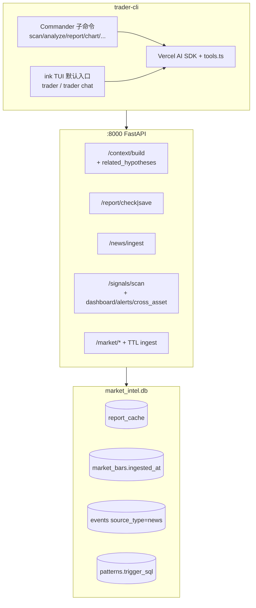

# CLI TUI v2 — Code Review Presentation

> **后续**：TUI 与 P2–P5 能力集成见 **T003**（`cli-tui-integration` / `.agent-dev/tasks/T003.json`）。本文档保留 T002 审查历史。

> **版本**: 2026-05-31（T002 实现 diff 审查）  
> **Spec**: `.agent-dev/specs/cli-tui-v2/` · **Task**: `T002.json`（steps 已标 completed）  
> **Slice 编排**: `.agent-dev/tasks/T002-slices/`  
> **受众**: 产品 / CLI / 后端 / 编排 Agent

---

## 1. 审查结论（Executive Summary）

| 维度 | 结论 |
|------|------|
| **Spec 符合度** | **高** — P0–P5 主路径已实现；blocking pytest（V105/V108/V110/V106 + schema）已绿 |
| **架构边界** | **合规** — 未改 `app/modules/`、`app/core/`、`trader-cockpit/`；schema 单文件演进（D114） |
| **可合并性** | **有条件通过** — 需补齐若干 **Important** 项与手工 V101/V102/V104 验收后再 merge |
| **测试** | 后端新增 4 个测试文件 + phase4 断言 `related_hypotheses`；CLI 仅 auditor 单测，**无 TUI E2E** |

**一句话**：增量实现扎实，缓存与 TTL 逻辑有测试兜底；TUI 与新闻三源、Dashboard 实时数据仍为「骨架 / 简化版」，与 spec 文案存在可接受的 MVP 差距，但应在 merge 前显式登记。

---

## 2. 变更规模

```text
约 22 个已跟踪文件变更（未 commit 工作区）
+ 新建: tui/**, report/chart/server/data/config, intel API/features/tests
- 删除: docs/03-forward-market-intel-worker-prompt.md（内容迁至 .agent-dev/cli-tui-v2-worker-prompt.md）
```

| 区域 | 新建 | 修改 | 说明 |
|------|------|------|------|
| `trader-cli` | 6 commands + `tui/**` | `index.ts`, `chat.ts`, `tools.ts`, `client.ts` | ink v7 + 5 子命令 |
| `trader-agent/intel` | 5 模块 + 4 tests | `schema`, `context`, `signals`, `market_data` | 缓存 / TTL / 探索 / 新闻 |
| `.agent-dev` | `T002-slices/*`, `dev-plan`, worker prompt | `T002.json` completed | 编排 artifact |

---

## 3. 架构回顾（实现后）



**决策落地（抽查）**

| ID | 要求 | 实现状态 |
|----|------|----------|
| D101 | ink + Commander 共存 | ✅ 默认 `tui`；子命令文本输出 |
| D102 / D108 | 业务记录 vs chat 内存分离 | ✅ `context.build` + ChatPage `messages` slice(-20) |
| D105 / D113 | report_cache 含 `latest_signal_ts` | ✅ check 端点实时 `MAX(ts)` |
| D109 | TTL **跳过 HTTP** | ✅ mock 断言 0 calls |
| D110 | seed 后回填 `trigger_sql` | ✅ 迁移顺序已修正 |
| D111 | pattern/cross 不进 SCANNERS | ✅ 独立 pass + scan 响应扩展 |
| D112 | `chat --eval` 保留 | ✅ 不进 ink |
| D103 | RSS+API+Web 三源 | ⚠️ **仅 RSS 骨架 + stub**（见 Findings） |

---

## 4. Phase 对照审查

### P0 — ink TUI 框架

**做得好的**

- 组件拆分清晰：`Sidebar` / `ContentArea` / `StatusBar` / `HotkeyBar`
- `index.ts` 使用 Commander `isDefault: true` 符合 D101
- `tsconfig` 已开 `jsx: react-jsx`

**差距 / 风险**

| 严重度 | 项 | 说明 |
|--------|-----|------|
| Important | StatusBar 写死 | `health="ok"`, `signalCount={0}` — 未接 `/health` 或 signals API |
| Minor | Dashboard/Signals/Lessons | 占位文案，spec 期望「实时视图」未实现 |
| Minor | V101 | 非 TTY 环境 Ink 报错属预期；需本机终端手工验 |

---

### P1 — Chat + related_hypotheses

**做得好的**

- `_list_related_hypotheses` 字段与 worker prompt 一致
- `hypotheses` GET 已扩 `professional_explanation`
- `getRelatedHypotheses` tool 已注册
- `chat.ts` mojibake 已修复；`--eval` 与 TTY ink 分流合理

**差距**

| 严重度 | 项 | 说明 |
|--------|-----|------|
| Minor | ChatPage 截断 | 单条展示 `slice(0,500)`，长回复不可滚动浏览 |
| Minor | V102/V109 | 依赖 LLM key + 后端；无自动化 E2E |

---

### P2 — 报表缓存 + 市场 TTL

**做得好的**

- `report_cache` 表 + UNIQUE 三元组正确
- check/save 分离；新 signal 使 cache miss（测试覆盖）
- `ingest_symbol` TTL short-circuit 有 **mock 级** 回归测试
- CLI `report` 打印 `[缓存命中]` 满足 V104 可观测性

**差距**

| 严重度 | 项 | 说明 |
|--------|-----|------|
| Important | V104 无自动化 | 需 LLM + 真实 DB；merge 前建议录一次手工日志 |
| Minor | `report` 无 dry-run | 首次必调 LLM，CI 成本高 |

---

### P3 — 探索发现

**做得好的**

- `_migrate_pattern_trigger_sql` 在 **`_seed_patterns` 之后**执行（修复了「空表 UPDATE」坑）
- `scan_patterns` / `calc_cross_asset_correlation` / `build_anomaly_dashboard` 并入 scan 响应
- V110 pytest 覆盖 migration + trigger hit

**差距**

| 严重度 | 项 | 说明 |
|--------|-----|------|
| Minor | `cross_asset.anomalies` | 恒 `[]`，worker prompt 标注「后期补」 |
| Minor | pattern_matcher | 仅 alert 列表，**未**自动 INSERT `pattern_alert` signal（与部分 prompt 叙事略有出入） |

---

### P4 — chart + server

**做得好的**

- `chart` 走 `/market/bars`，asciichart 输出
- `fetchHealth()` 正确去掉 `/api/intel` 前缀
- `server stop` 区分 win32 / darwin（D106）

**差距**

| 严重度 | 项 | 说明 |
|--------|-----|------|
| Important | `server start` cwd | 依赖 `REPO_ROOT` 环境变量，未设置时 `process.cwd()` 可能不是 monorepo 根 |
| Minor | `server start` 无集成测试 | V107 需手工起后端 |

---

### P5 — 新闻 + data/config

**做得好的**

- `/news/ingest` + `events.source_type='news'` 有 pytest
- `create_event` 复用，无新表（D103）

**差距（Spec 差距最大）**

| 严重度 | 项 | 说明 |
|--------|-----|------|
| **Important** | D103 三源未齐 | `RSS_FEEDS=[]`；无 Alpha Vantage news / Web crawl 实现 |
| **Important** | 生产数据 | `include_stub=True` 时无真实爬取会写入 **stub 事件** — 生产需关 stub 或配置源 |
| Important | `trader data status` | **实际调用 ingest POST**，与「status」语义不符，且可能触发 yfinance |
| Minor | `feedparser` | 可选 import，未写入 `pyproject.toml` 依赖 |

---

## 5. Spec scope 差异清单

| spec.json `scope.create` | 状态 |
|--------------------------|------|
| `apps/trader-cli/src/tui/**` | ✅ |
| `apps/trader-cli/src/cache/**` | ❌ **未创建**（spec 列出但实现未做 CLI 侧 cache 模块；逻辑在后端+report 命令） |
| 其余 listed create/modify | ✅ 基本齐全 |
| `app/intel/db/__init__.py` | 未改（通常无需） |
| `app/main.py` | 未改（路由经 `api/__init__.py` 挂载即可） |

**建议**：更新 `spec.json` 将 `src/cache/**` 标为 non-goal 或拆 follow-up task，避免 Codex review 报 scope drift。

---

## 6. 测试矩阵

| Verification | 自动化 | 结果 |
|--------------|--------|------|
| V101 TUI 启动 | ❌ 需 TTY | 待手工 |
| V102 TUI chat | ❌ | 待手工 |
| V103 chart | ❌ | 待手工 |
| V104 report 缓存 | ❌ | 待手工（pytest 覆盖后端） |
| V105 report_cache pytest | ✅ | **PASS** |
| V106 news ingest | ✅（stub） | **PASS** |
| V107 server status | ❌ | 待手工 |
| V108 TTL pytest | ✅ | **PASS** |
| V109 chat --eval | ❌ | 待手工 |
| V110 pattern pytest | ✅ | **PASS** |
| phase0_schema | ✅ | **PASS** |
| phase4_context | ✅ | **PASS** |
| trader-cli auditor | ✅ | **7/7 PASS** |

**已跑命令（审查时）**

```bash
.venv/Scripts/python.exe -m pytest \
  apps/trader-agent/backend/tests/test_intel_cache_report.py \
  apps/trader-agent/backend/tests/test_intel_cache_market_ttl.py \
  apps/trader-agent/backend/tests/test_intel_pattern_matcher.py \
  apps/trader-agent/backend/tests/test_intel_news_crawler.py \
  apps/trader-agent/backend/tests/test_intel_phase0_schema.py \
  apps/trader-agent/backend/tests/test_intel_phase4_context.py -v --tb=short
# → 10 passed

cd apps/trader-cli && npm test
# → 7 passed
```

---

## 7. Findings 汇总（Review Gate）

### Blocker（merge 前必须处理）

*当前无代码级 blocker*（pytest 全绿、禁止路径未触碰）。

### Important（强烈建议 merge 前或紧跟 PR）

1. **新闻 D103**：补齐 `RSS_FEEDS`、Alpha Vantage news、Web crawl，或更新 spec/decision 接受 stub-only MVP。
2. **`trader data status`**：改为只读状态（查 DB TTL / 行数 / 最后 ingest），**不要** POST ingest。
3. **`server start`**：默认 `cwd` 指向 repo root（读 `bootstrap-env` / `package.json` 向上查找）。
4. **生产 stub 新闻**：`ingest_news(..., include_stub=False)` 由 API 查询参数或 env 控制。
5. **手工验收记录**：V101/V102/V104/V107/V109 跑一轮并贴终端截图或日志到 PR。

### Minor（可 follow-up）

- StatusBar 接真实 health / signal count
- Dashboard 页拉 signals/lessons 摘要
- ChatPage 滚动/分页
- `cross_asset.anomalies` 实现
- 将 `feedparser` 加入 backend 可选依赖
- 统一 `docs/` vs `.agent-dev/` worker prompt 路径（已删旧 docs 文件，需确认团队书签）

### 做得好的实践（保留）

- schema 迁移顺序（seed → trigger_sql UPDATE）
- TTL 测 mock **HTTP** 而非仅 DB
- report_cache 失效语义与 signal `MAX(ts)` 绑定
- slice prompt 工件可复用于下一轮 subagent 编排

---

## 8. 合并前 Checklist（给 Reviewer）

```markdown
- [ ] 本机 V101: `cd apps/trader-cli && npx tsx src/index.ts` → 侧栏 + HotkeyBar
- [ ] 本机 V102: `npx tsx src/index.ts chat` → ink ChatPage 可对话
- [ ] 本机 V109: `npx tsx src/index.ts chat --eval "列出 TSLA 之前的假设记录"`
- [ ] 后端已启: `npm run trader-agent:backend:dev`
- [ ] V104: `report TSLA` 两次，第二次含 `[缓存命中]`
- [ ] V107: `server status` → status:ok, intel_route_count>=14
- [ ] 确认是否接受 news stub / data status 行为，或开 issue 跟进
- [ ] Codex review 对比 spec.json scope（含 cache/** 漂移）
- [ ] 用户明确要求后再 git commit（当前为未提交工作区）
```

---

## 9. 建议下一步

| 优先级 | 动作 |
|--------|------|
| P0 | 手工跑 Section 8 checklist，结果写入 PR 描述 |
| P1 | 修 `data status` + `server start` cwd + news stub 开关 |
| P2 | 配置真实 `RSS_FEEDS` + `feedparser` 依赖 |
| P3 | StatusBar / Dashboard 接 API（提升 TUI 产品完成度） |
| P4 | 可选：Vitest + ink-testing-library  smoke；或 documented manual script |

---

## 10. 相关链接

| 文档 | 路径 |
|------|------|
| Spec（人读） | `.agent-dev/specs/cli-tui-v2/spec.md` |
| Spec（机读） | `.agent-dev/specs/cli-tui-v2/spec.json` |
| 决策 D101–D114 | `.agent-dev/specs/cli-tui-v2/decision-record.json` |
| Worker 实现指令 | `.agent-dev/cli-tui-v2-worker-prompt.md` |
| 多 Agent 计划 | `.cursor/plans/cli_tui_v2_多_agent_e1f14c84.plan.md` |
| Slice 下发 | `.agent-dev/tasks/T002-slices/README.md` |
| 父 Spec 演示 | `.agent-dev/presentations/forward-market-intel-dev-presentation.md` |

---

*本演示文稿仅用于 Code Review，不代表已 merge 或已部署生产。*
