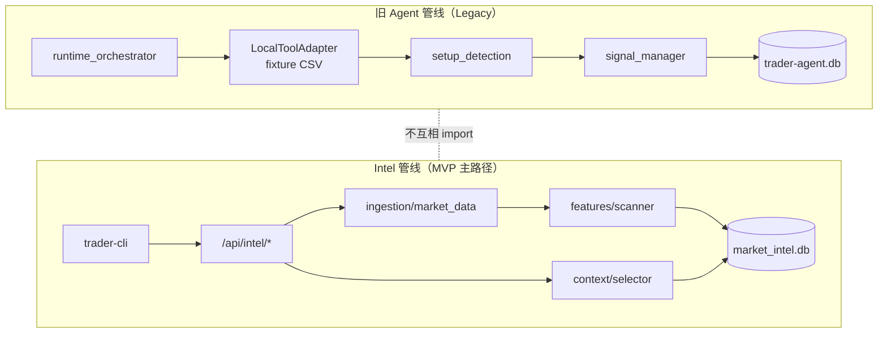
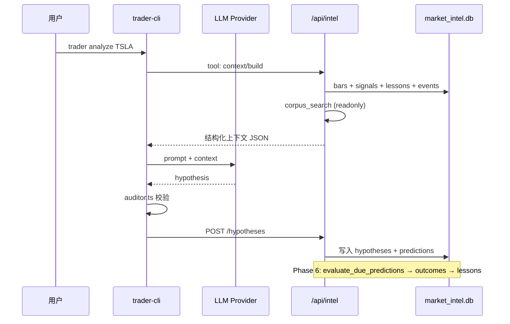

# Forward Market Intelligence — Dev Presentation

> **版本**: 2026-05-31（D010 边界修复后）  
> **Spec**: `.agent-dev/specs/forward-market-intel/`  
> **受众**: 后端 / CLI / 产品协作开发者

---

## 1. 我们在建什么

**Forward Market Intelligence（FMI）** 是一套面向交易研究的市场情报闭环：

```
行情 ingest → 特征扫描 → 信号 → LLM 假设 → 复盘 → Lesson → 反哺上下文
```

MVP 目标不是自动下单，而是：

- 把 Whop 群聊 / 文档里的交易规律结构化
- 用真实行情 + 事件 + 语料做 **可审计** 的推理
- 通过 CLI + LLM tool-use 验证后端闭环

---

## 2. 核心架构决策（14 条）

| ID | 决策 | 含义 |
|----|------|------|
| D001 | `app/intel/` 子目录 | 复用 repo，不新建独立项目 |
| D002 | `market_intel.db` | 与旧 `trader-agent.db` **物理隔离** |
| D003 | LLM 只在 CLI | Python 后端 = 纯数据层，零 LLM key |
| D005 | Auditor 在 CLI | blocker 2 + warning 8 |
| D010 | 不依赖旧 memory | intel **禁止** import `context_selector` / `memory_service` |
| D011 | 新 context selector | 只查 `lessons` 表 |
| D014 | 单端口 `:8000` | `/api/intel/*` 挂载在现有 FastAPI |

完整 rationale → `decision-record.json`

---

## 3. 双管线边界（最重要）

当前 repo 存在 **两条并行、互不调用** 的管线：



| 维度 | Legacy | Intel |
|------|--------|-------|
| 入口 | `POST /api/agent/run-scan` | `POST /api/intel/*` + `trader` CLI |
| 数据源 | fixture CSV | yfinance / Alpha Vantage → DB |
| 信号检测 | `setup_detection.py` | `intel/features/scanner.py` |
| 上下文 | `memory_items`（旧 API 仍可用） | `lessons` 表 + `select_lessons()` |
| DB | `data/trader-agent/trader-agent.db` | `data/market_intel.db` |

**D010 修复（2026-05-31）** 已回滚以下越界改动：

- `playbook.py` 不再写 `memory_items`
- `runtime_orchestrator.py` 不再注入 `select_context` / `_feed_signal_to_memory_candidate`
- `core/config.py` 不再读 `ALPHAVANTAGE_API_KEY` env（改由 intel ingestion 负责）
- 新增 `test_intel_d010_boundary.py` 静态扫描 intel 包

---

## 4. Intel 模块地图

```
app/intel/
├── api/              REST 端点（9 个子 router）
│   ├── context.py    POST /context/build — LLM 上下文组装
│   ├── market.py     POST /market/ingest
│   ├── signals.py    POST /signals/scan, GET /signals
│   ├── events.py     事件 CRUD + ARK ingest
│   ├── hypotheses.py 假设管理
│   ├── lessons.py    复盘 lesson 查询
│   ├── trade_ideas.py
│   ├── jobs.py       premarket / close 任务
│   └── corpus.py     语料检索（只读引用 corpus_search）
├── db/
│   ├── connection.py market_intel.db 连接
│   └── schema.py     表定义 + init_intel_db()
├── ingestion/
│   ├── market_data.py      yfinance / AV，MARKET_DATA_PROVIDER
│   ├── alpha_vantage_data.py  AV REST + env key fallback
│   ├── events_ingest.py
│   └── seed_lessons.py     冷启动 seed
├── features/scanner.py     MVP 特征 + 信号扫描
├── context/selector.py     lessons 选取（D011）
├── postmortem/             预测评估 + lesson 生成
├── trade/ideas.py
└── jobs/                   premarket brief / close postmortem
```

**只读引用**（spec `readonly_import`）：

- `app/modules/corpus_search.py`
- `app/modules/_json.py`
- `app/core/time.py`
- `app/core/config.py`（只读，禁止修改）

---

## 5. 数据模型（market_intel.db）

| 表 | 用途 |
|----|------|
| `symbols` | MVP 8 标的元数据 |
| `market_bars` | 日线 + 5m K 线 |
| `events` | 新闻 / 宏观 / 社群事件 |
| `smart_money_actions` | ARK 等 smart money |
| `patterns` | 预置交易模式模板 |
| `signals` | scanner 输出（小时粒度 ID，D007） |
| `hypotheses` | LLM 生成的交易假设 |
| `predictions` | 可验证预测（含 reference_price） |
| `outcomes` | 到期评估结果 |
| `lessons` | 复盘 lesson + **context injection 源** |
| `trade_ideas` | 结构化交易想法 |

MVP 标的：`TSLA, TSLL, QQQ, SPY, ARKK, NVDA, COIN, BMNR`

---

## 6. API 面（:8000）

挂载点：`app/main.py` → `intel_router` prefix `/api/intel`

| 方法 | 路径 | 说明 |
|------|------|------|
| POST | `/market/ingest` | 拉取并写入 bars |
| POST | `/signals/scan` | 全 universe 扫描 |
| GET | `/signals` | 列表 / 过滤 |
| POST | `/context/build` | 组装 LLM 上下文包 |
| GET/POST | `/events/*` | 事件管理 |
| GET/POST | `/hypotheses/*` | 假设 CRUD |
| GET | `/lessons` | lesson 列表 |
| GET | `/trade-ideas` | 交易想法 |
| POST | `/jobs/premarket` | 盘前 brief 数据 |
| POST | `/jobs/close` | 收盘复盘 |
| GET | `/corpus/search` | 文档语料检索 |

健康检查：`GET /health` → `{ status, intel_route_count }`（≥ 14）

Swagger：`http://localhost:8000/docs` → 标签 `intel-*`

---

## 7. CLI 工作流（trader-cli）

```
apps/trader-cli/
├── src/commands/     scan | analyze | brief | review | chat | ...
├── src/llm/          provider.ts | auditor.ts | tools.ts
└── src/api/client.ts → TRADER_API_BASE (/api/intel)
```

| 命令 | 作用 | 后端依赖 |
|------|------|----------|
| `trader scan` | 触发信号扫描 | POST `/signals/scan` |
| `trader analyze TSLA` | LLM 深度分析 | tool call → `/context/build` 等 |
| `trader brief` | 盘前数据包 | `/jobs/premarket` |
| `trader review` | 收盘复盘包 | `/jobs/close` |
| `trader chat` | 交互对话 | 多 tool 自主调用 |
| `trader signals` | 信号列表 | GET `/signals` |
| `trader lessons` | lesson 列表 | GET `/lessons` |

LLM 配置（`.env`，CLI 侧）：

```env
LLM_API_KEY=
LLM_PROVIDER=deepseek
TRADER_API_BASE=http://127.0.0.1:8000/api/intel
MARKET_DATA_PROVIDER=auto          # intel ingestion 读取
ALPHAVANTAGE_API_KEY=              # intel ingestion 读取（非 core/config）
```

---

## 8. 端到端数据流



Context 注入预算（D013）：10 条 / 600 字符每条 / 6000 字符总计

---

## 9. 本地启动 & 验证

### 启动

```bash
# 1. 确保 8000 端口空闲
npm run trader-agent:backend:stop

# 2. 启动后端（dev_server.py + factory uvicorn）
npm run trader-agent:backend:dev

# 3. 健康检查
npm run trader-agent:intel:ping
# 或 curl http://127.0.0.1:8000/health  → intel_route_count >= 14
```

### 阻塞验收（V001–V006）

```bash
# V001 ingest
curl -s -X POST localhost:8000/api/intel/market/ingest

# V002 scan
curl -s -X POST localhost:8000/api/intel/signals/scan

# V003 context
curl -s -X POST localhost:8000/api/intel/context/build \
  -H 'Content-Type: application/json' \
  -d '{"symbols":["TSLA"],"task_type":"signal_explanation"}'

# V004 analyze
npm run trader-cli -- analyze TSLA

# V006 postmortem tests
.venv/Scripts/python.exe -m pytest apps/trader-agent/backend/tests/test_intel_phase6_postmortem.py -v
```

### Intel 测试套件

```bash
.venv/Scripts/python.exe -m pytest apps/trader-agent/backend/tests/test_intel_*.py -v --tb=short
```

含 D010 边界：`test_intel_d010_boundary.py`

---

## 10. Spec 边界 — 开发禁区

| 区域 | 规则 |
|------|------|
| `app/modules/**` | **禁止修改**（Legacy 管线） |
| `app/core/**` | **禁止修改**（Settings 只读引用） |
| `apps/trader-cockpit/**` | 禁止修改 |
| `trader-agent.db` | intel 任务禁止写入 |
| `app/intel/**` | 新功能在这里 |
| `apps/trader-cli/**` | CLI + LLM + Auditor |

违反 D010 的典型反模式（已修复，勿再引入）：

- intel 代码 import `memory_service` / `context_selector`
- 在 Legacy 模块里新增 memory injection
- 在 `core/config.py` 加 env fallback（应放 `intel/ingestion/`）

---

## 11. Known Gaps（MVP 已知限制）

| Gap | 说明 |
|-----|------|
| D008 | 无 API 认证，仅 localhost |
| 双 scanner | Legacy `setup_detection` 与 intel `scanner` 逻辑独立，未统一 |
| Legacy API 仍存活 | `/api/agent/*` memory CRUD 可用，但 intel 不依赖 |
| Cockpit | 尚未对接 intel API（forbidden 范围外） |
| 网络部署 | 需补 auth + CORS 策略 |

---

## 12. 下一步建议

1. **合并 intel 挂载** — 确保 `main.py` intel 改动已 commit，避免 8000 旧进程占位
2. **跑全量 V001–V007** — 在干净端口上阻塞验收
3. **Codex Review** — 对比 spec scope + D010 边界测试
4. **产品决策** — Legacy orchestrator 是否标记 deprecated，或 Cockpit 切 intel API

---

## 附录：文件索引

| 资源 | 路径 |
|------|------|
| Spec | `.agent-dev/specs/forward-market-intel/spec.json` |
| 决策记录 | `.agent-dev/specs/forward-market-intel/decision-record.json` |
| Code Map | `.agent-dev/context/code_map.md` |
| 系统设计 | `docs/01-forward-market-intelligence-system-design.md` |
| MVP 计划 | `docs/03-forward-market-intel-mvp-plan.md` |
| 8000 排障 | `.agent-dev/reviews/backend-intel-8000-review.md` |
