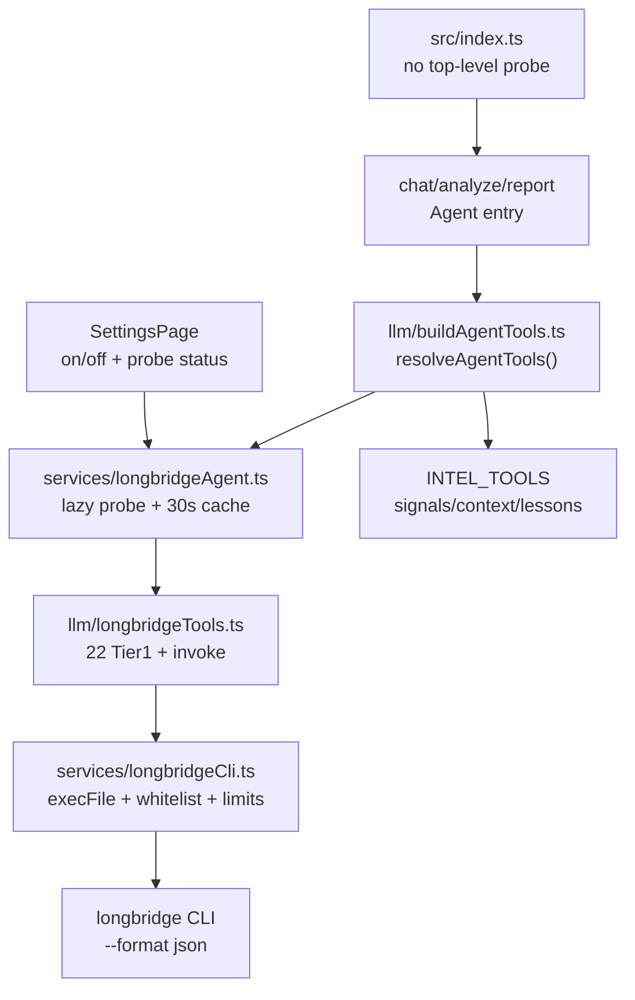
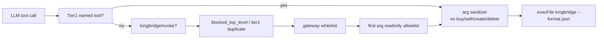

# T005 Longbridge CLI Agent — Code Presentation

**Date**: 2026-06-01  
**Task**: `T005`  
**Spec**: `trader-longbridge-agent-cli`  
**Audience**: product owner, CLI maintainer, reviewer agent, implementation worker  
**Status**: implementation mostly present; plan artifacts need reconciliation before final code review

---

## 1. Executive Summary

| Dimension | Status |
|---|---|
| Goal | Expose Longbridge CLI read-only market/account intelligence to the trader CLI Agent |
| Design | 22 Tier1 named tools + `longbridgeInvoke` whitelist gateway |
| Safety | Blocks orders, write operations, unsafe args, and infrastructure-only `check` |
| Startup | Longbridge probe moved to lazy Agent path with 30s cache |
| Tests | `apps/trader-cli` unit suite passes locally |
| Plan gate | `revise_required` because T005 artifacts disagree on completion and manual evidence |

One-line read: the code direction is coherent and the automated tests are green, but T005 should not be treated as a cleanly closed task until the plan/status docs and manual verification evidence are fixed.

---

## 2. User-Facing Behavior

```text
TRADER_LONGBRIDGE_AGENT=on
  -> Chat / analyze / report Agent path can use Longbridge tools
  -> objective market facts prefer Longbridge
  -> intel tools still own signals, hypotheses, lessons, and system evidence

TRADER_LONGBRIDGE_AGENT=off
  -> Agent stays intel-only
  -> Dashboard [l]/[L] external Longbridge handoff remains unchanged
```

The new switch is independent from `MARKET_DATA_PROVIDER`.

---

## 3. Architecture



Key property: non-Agent CLI commands should not run Longbridge probe during startup.

---

## 4. File Map

| File | Role |
|---|---|
| `apps/trader-cli/src/services/longbridgeAgent.ts` | env mode, lazy probe, 30s cache, bootstrap warning |
| `apps/trader-cli/src/services/longbridgeCli.ts` | CLI gateway, top-level whitelist, arg sanitizer, timeout/truncation |
| `apps/trader-cli/src/llm/longbridgeTools.ts` | 22 named tools and `longbridgeInvoke` |
| `apps/trader-cli/src/llm/buildAgentTools.ts` | merges `INTEL_TOOLS` and Longbridge tools after lazy probe |
| `apps/trader-cli/src/llm/tools.ts` | system prompt and Longbridge prompt patch |
| `apps/trader-cli/src/tui/pages/SettingsPage.tsx` | Settings UI for Longbridge Agent switch and probe refresh |
| `apps/trader-cli/src/services/longbridgeAgent.test.ts` | probe failure/success/cache tests |
| `apps/trader-cli/src/services/longbridgeCli.test.ts` | whitelist, blocklist, subcommand tests |
| `apps/trader-cli/src/llm/longbridgeTools.test.ts` | tool count, Tier1 mapping, safety tests |

---

## 5. Critical Decisions

| Decision | Result |
|---|---|
| D301 | `TRADER_LONGBRIDGE_AGENT=on/off`, independent from market ingest provider |
| D302 | Hybrid tool exposure: Tier1 named tools plus whitelist gateway |
| D303 | No trading/write operations; `order` family blocked |
| D306 | Objective market facts prefer Longbridge; system evidence stays intel |
| D310 | Probe is lazy, not top-level startup blocking |
| D311 | `getLongbridgeQuote` supports single symbol or up to 10 symbols |
| D312 | `check` is infrastructure-only and not exposed through invoke |

---

## 6. Safety Model



The gateway rejects:

- trading/write command families
- Tier1 commands through invoke
- non-whitelisted top-level commands
- infrastructure-only `check`
- unsafe first subcommands
- dangerous arg tokens and shell metacharacters
- over-limit count/limit values

---

## 7. Verification Matrix

| Check | Evidence |
|---|---|
| Longbridge Agent probe tests | `npm test -- src/services/longbridgeAgent.test.ts ...` passed |
| Full trader CLI unit suite | `npm test` passed, 35 tests |
| Longbridge invoke rejects `order` | covered by `longbridgeTools.test.ts` |
| Longbridge invoke rejects `check` | covered by `longbridgeTools.test.ts` |
| `getLongbridgeQuote` rejects >10 symbols | covered by `longbridgeTools.test.ts` |
| Non-Agent command startup target | current `npx tsx src/index.ts scan --help` measured about 2167ms, so V306 needs a better metric or evidence |
| Dashboard `[l]/[L]` unchanged | still manual; no evidence artifact found in T005 |

---

## 8. Plan Review Findings

| ID | Severity | Summary |
|---|---|---|
| P001 | critical | `T005.json` says done, but `T005.md` and slice README still say in progress / execute S0 |
| P002 | critical | S8 is done without V304/V306 evidence; V306 command failed the stated `<300ms` target locally |
| P003 | important | Deep review plan is referenced from local Cursor path, not a durable repo artifact |
| P004 | important | Valid `symbols[<=10]` success path is not tested |

Full review: `.agent-dev/reviews/T005-plan-review.md`.

---

## 9. Recommended Next Step

Before `Review task T005`, fix the plan artifacts:

1. Update `T005.md` and `T005-slices/README.md` to match the real completion state.
2. Replace the stale S0 drift table with actual audit results.
3. Attach or record V303/V304/V306 evidence, or revise V306 to a deterministic no-probe assertion.
4. Add the missing valid multi-symbol success test.
5. Preserve the deep review basis under `.agent-dev/reviews/` or `dev-plan.md`.

Then run:

```text
Review task T005
```
