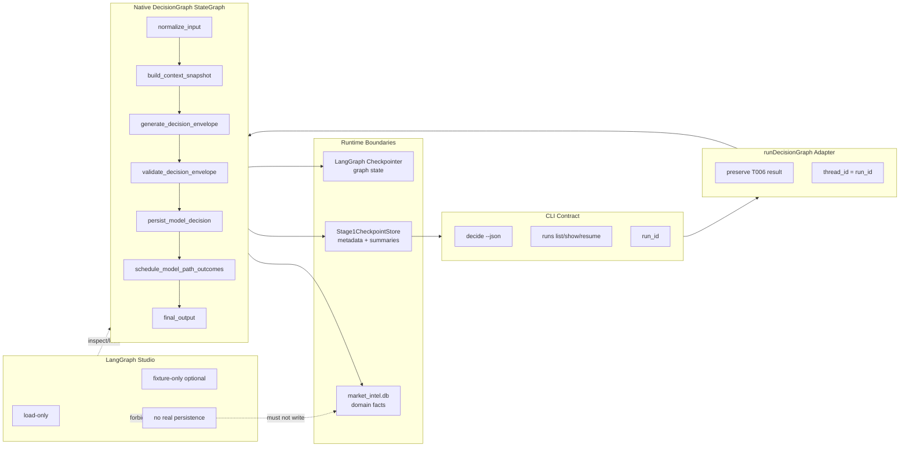

# T007 LangGraph-Native DecisionGraph - Dev Presentation

> Date: 2026-06-02
> Task: `.agent-dev/tasks/T007.md`
> Spec: `.agent-dev/specs/langgraph-native-decisiongraph/`
> ADR: `project-docs/adr/0001-langgraph-minimal-stage1.md`
> Audience: project owner, implementation worker, review agent
> Format: Markdown dev presentation plus image2 schematic prompt, not PPT
> Generated schematic: `outputs/manual-20260602-t007-dev-presentation/t007-architecture-schematic.png`

---

## 1. Executive Summary

T007 is a focused runtime refactor. It turns the T006 `DecisionGraph` from a hand-written class flow wrapped by a one-node LangGraph shell into a real LangGraph-native `StateGraph`.

The user-facing contract must stay stable:

| Surface | T007 rule |
|---|---|
| CLI decision command | `trader decide SYMBOL --json` still returns the existing workflow JSON envelope |
| Run identity | `run_id` remains the user-facing id |
| LangGraph identity | `thread_id = run_id` for native `DecisionGraph` runs |
| Public adapter | `runDecisionGraph(input)` remains the caller-facing function |
| Studio | load-only plus optional fixture-only invocation |
| Domain writes | real persistence still goes through workflow CLI / `Stage1Runtime` |

One-line read: T007 changes the runtime shape, not the product scope.

---

## 2. Why T007 Exists

T006 already introduced `apps/trader-workflows`, but the current architecture is only LangGraph-shaped. `Stage1Runtime` wraps a normal `DecisionGraph` class inside a generic one-node `StateGraph`.

That creates three problems:

1. Studio cannot inspect the real business workflow node by node.
2. Checkpoint ownership is ambiguous because the class flow and run registry both look like runtime state owners.
3. Future resume/replay/HITL work has no clean native graph boundary.

T007 fixes this by moving the actual business nodes into the compiled LangGraph graph.

---

## 3. Target Architecture

T007 has one native graph and three bounded surfaces.

| Layer | Responsibility |
|---|---|
| `apps/trader-cli` | Thin CLI wrapper; preserves decide and runs commands |
| `apps/trader-workflows` | Owns native `DecisionGraph`, adapter, Studio config, runtime integration |
| LangGraph checkpointer | Owns graph state, checkpoint lineage, resume/replay mechanics |
| `Stage1CheckpointStore` | Downgraded to run registry, CLI envelope, bounded metadata |
| Backend / domain DB | Owns trading-domain facts such as context snapshots, decisions, outcomes |
| LangGraph Studio | Loads `decision_graph`; no direct real-persistence path in T007 |

The important boundary is not "where can we store more data". The important boundary is "which layer owns which type of state".

---

## 4. Native DecisionGraph Flow

The native graph sequence is:

```text
normalize_input
-> build_context_snapshot
-> generate_decision_envelope
-> validate_decision_envelope
-> persist_model_decision
-> schedule_model_path_outcomes
-> final_output
```

This sequence is the business workflow. The compiled LangGraph graph must be the source of truth, not a Studio-only wrapper and not a placeholder around the old class.

The public adapter still returns the T006 result shape:

```text
run_id
snapshot
decision
envelope
scheduled_outcomes
paper_execution_submitted: false
```

---

## 5. State Boundary

T007 separates three state categories.

| Category | Owner | Allowed content |
|---|---|---|
| Runtime graph state | LangGraph checkpointer | processed context, weighted items, evidence refs, envelope, decision ids, bounded errors |
| Run metadata | `Stage1CheckpointStore` | `run_id`, `graph_name`, `status`, `thread_id`, `checkpoint_ref`, bounded input/output summaries |
| Trading-domain facts | backend / `market_intel.db` | context snapshots, model decisions, decision outcomes, future labels |

Native graph state must not contain:

- raw news article full text
- provider raw JSON payloads
- image blobs or chart screenshots
- large K-line arrays
- full gather traces
- large model traces

This keeps checkpoints replayable and inspectable without turning them into a second evidence store.

---

## 6. Studio Boundary

T007 adds the minimal Studio path:

```text
cd apps/trader-workflows
npx @langchain/langgraph-cli dev
```

Required Studio behavior:

| Allowed | Forbidden |
|---|---|
| Load `decision_graph` | Register future graph placeholders |
| Show native node topology | Run real domain writes directly from Studio |
| Optional fixture-only invocation | Persist `context_snapshots`, `model_decisions`, or `decision_outcomes` outside workflow CLI / `Stage1Runtime` |
| Local smoke documentation | Build custom workflow UI or React Flow editor |

Studio is a visibility and load path in T007. It is not a second production execution path.

---

## 7. Slice Plan

| Slice | Scope | Gate |
|---|---|---|
| S0 | Spec gate and T006 contract lock | prove existing contract before changing runtime |
| S1 | `langgraph.json`, dependencies, foundation | config only; no placeholder graph required |
| S2 | Native graph state/nodes, compiled export, adapter preservation | `runDecisionGraph` invokes compiled graph with `thread_id = run_id` |
| S3 | Run registry and LangGraph checkpointer boundary | registry stores metadata, not full graph state |
| S4 | CLI, Studio, docs, forbidden-scope verification | decide/runs contract and Studio load smoke stay clean |

Execution rule: keep T007 as the umbrella task, but review implementation by slice. Do not start later slices by inventing placeholders in earlier ones.

---

## 8. Current Review Status

The architecture review is mostly resolved:

| Finding | Current state |
|---|---|
| P001 run registry/checkpointer boundary | fixed |
| P002 Studio direct persistence risk | fixed |
| P003 `langgraph.json` shape | fixed |
| P004 slice dependency issue | fixed |
| P005 verification gaps | fixed |
| P006 schema-invalid `planned` status | still open |

Current verdict remains `revise_required` until `planned` is replaced with schema-valid status values or the repo schema is explicitly updated.

This is not an architecture blocker. It is an artifact compliance blocker before worker handoff.

---

## 9. Worker Takeaway

Implement only the native `DecisionGraph` path.

Do:

- export a real compiled `decisionGraph`
- keep `runDecisionGraph(input)` as the adapter
- pass `configurable.thread_id = run_id`
- keep CLI JSON output and run registry contract stable
- store only bounded summaries in run registry rows
- document Studio load smoke

Do not:

- migrate `OutcomeGraph`, `EvaluationGraph`, or `InsightExplorationGraph`
- add backend schema or API changes
- add `apps/trader-cockpit` UI
- add custom workflow UI
- expose raw evidence objects in graph state or `runs show`
- allow Studio direct real-persistence

The shortest next step is to fix P006, then hand S1 to the worker.

---

## 10. Image2 Schematic Prompt

Generated asset:


Use this prompt to regenerate or refine one architecture schematic for the presentation.

```text
Use case: infographic-diagram
Asset type: developer presentation architecture schematic, 16:9
Primary request: Create a clean technical architecture diagram for T007: LangGraph-native DecisionGraph.

Composition:
- Light neutral background, flat vector style, crisp lines, no logos, no screenshots, no decorative characters.
- Arrange the diagram left to right with five zones.
- Zone 1 label: CLI Contract
- Zone 2 label: runDecisionGraph Adapter
- Zone 3 label: Native DecisionGraph StateGraph
- Zone 4 label: Runtime Boundaries
- Zone 5 label: LangGraph Studio

Content:
- In CLI Contract, show two compact items: "decide --json" and "runs list/show/resume".
- Arrow from CLI Contract to runDecisionGraph Adapter.
- In runDecisionGraph Adapter, show "run_id" and "thread_id = run_id".
- Arrow from adapter to Native DecisionGraph StateGraph.
- In Native DecisionGraph StateGraph, show seven small connected nodes:
  normalize_input -> build_context_snapshot -> generate_decision_envelope -> validate_decision_envelope -> persist_model_decision -> schedule_outcomes -> final_output
- Under the StateGraph, show a thin connection to "LangGraph Checkpointer".
- In Runtime Boundaries, draw three separated lanes:
  "Runtime State: processed context + evidence refs"
  "Run Registry: metadata + summaries"
  "Domain Facts: snapshots + decisions + outcomes"
- Connect Run Registry to CLI Contract with a return arrow labeled "bounded run metadata".
- Connect Domain Facts only through workflow runtime, not Studio.
- In LangGraph Studio, show "load-only" and "fixture-only optional".
- Add a red or muted warning line from Studio: "no real persistence".

Style constraints:
- Minimal exact text only; avoid paragraphs.
- High readability at presentation size.
- Use restrained colors: charcoal text, blue for CLI/runtime path, green for graph nodes, amber for boundaries, muted red for forbidden Studio persistence.
- Do not include company logos, stock tickers, candlesticks, trader screens, dashboards, or photorealistic elements.
```

---

## 11. Mermaid Reference

Use this deterministic version to check the image2 output for conceptual correctness.


