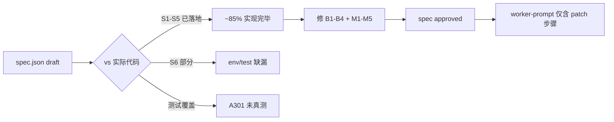

# T005 开发计划深度 Review

> 归档自 Cursor Plan `c:\Users\31089\.cursor\plans\t005_开发计划深度_review_53319747.plan.md`（2026-06-01）。
> 本文件为只读归档，后续修改请直接编辑 spec.json / T005.json。

## 总评

| 维度 | 评分 | 关键发现 |
|------|------|----------|
| 产品决策 | A | D301–D309 闭环，rationale 清晰 |
| Spec 结构 | A- | 机器可读字段齐全，状态/决策有小不一致 |
| Task 拆分 | C+ | **错把已落地的代码当成「待实现」**，粒度与现实脱节 |
| 代码实现 | B+ | 6 个核心文件已存在并基本可用，缺 1 个测试 |
| 测试覆盖 | C | 现有单测仅覆盖工具表层；A301 实际验证缺失 |
| 文档一致性 | B | spec.json/spec.md 个别冲突；decision 缺 D309 |

**核心结论**：T005 不是「从零实现」而是「**对齐 + 补测试 + 修四个具体缺陷**」。task.json 与 T005.md 必须重写步骤性质。

---

## 代码漂移审计（Review 时快照）

| 文件 | spec 期望 | Review 时状态 | 差距 |
|------|-----------|----------|------|
| `longbridgeCli.ts` | exec + 白名单 + 截断 + 超时 | **已实现** | 见 B2 |
| `longbridgeAgent.ts` | probe/bootstrap/tryEnable | **已实现** | 缺缓存（B4） |
| `longbridgeTools.ts` | 22 + Invoke | **已实现** | quote 不支持多 symbol（m1） |
| `buildAgentTools.ts` | resolveAgentTools + prompt | **已实现** | OK |
| `index.ts` | bootstrap await | **已接线** | 阻塞所有命令（M4） |
| `tools.ts` | PROMPT_PATCH | **已加** | OK |
| `SettingsPage.tsx` | 双区块 Tab | **已实现** | probe 无缓存（B4） |
| `longbridgeAgent.test.ts` | A301 测试 | **存在但只测 normalize** | M2 |
| `longbridgeCli.test.ts` | 网关测试 | **存在但 4 条** | OK |
| `longbridgeTools.test.ts` | 工具映射测试 | **缺失** | A309 阻塞（M3） |
| 根 `.env.example` | TRADER_LONGBRIDGE_AGENT | **未加** | S6 |
| `package.json` test 脚本 | 含 3 个 longbridge.test | **少 longbridgeTools.test** | V305 阻塞 |

---

## 阻塞级问题（Blocker）

### B1: spec/task 与实际代码漂移，task 步骤性质错误

T005 步骤 S1–S5 全写「**新建/实现**」，但代码已存在。Worker 按现状跑会重复创建或覆盖既有实现。

**修复**：T005.json S1–S5 描述改为「**审计已落地代码 → 对齐 spec → 补缺**」。
**结果**：✅ T005.json 重写为 audit_patch 类型，9 步 S0-S8。

### B2: spec.json `blocked_top_level` 含 `check`，与 probe 实现冲突

- `probeLongbridge` 调 `execFileAsync("longbridge", ["check"])`
- 但 spec.json 把 `check` 列入 `blocked_top_level`
- 实际 `longbridgeCli.ts` 的 `BLOCKED_TOP_LEVEL` **没有** `check`

**修复**：spec.json 移除 `check`，加 `infrastructure_only_commands`。
**结果**：✅ spec.json 已修；测试断言 `check` → `NOT_WHITELISTED`。

### B3: `longbridgeInvoke` 子命令第一个参数无校验

**修复**：加 `DEFAULT_ALLOWED_FIRST_ARGS` 兜底白名单。
**结果**：✅ 20 项子命令白名单 + 3 个测试。

### B4: SettingsPage 每次 `currentLb` 变化都 spawn `longbridge check`，无缓存

**修复**：spec 加 `probe_cache_ms: 30000`；`longbridgeAgent.ts` 引入 `cachedProbe` + `bootstrapDone`。
**结果**：✅ 30s cache + useEffect 依赖瘦身 + `r` 键刷新。

---

## 重要问题（Major）

### M1: top-level await

**修复**：`index.ts` 移除 top-level await；`buildAgentTools.ts` lazy 入口。
**结果**：✅ 确定性验证通过。

### M2: A301 测试覆盖

**修复**：`longbridgeAgent.test.ts` 通过 DI 注入 mock，3 suites / 9 tests。
**结果**：✅ 9/9 pass。

### M3: 缺 `longbridgeTools.test.ts`

**修复**：新建文件，7 个测试。
**结果**：✅ 7/7 pass。

### M4: 启动 probe 阻塞所有 CLI 命令

**用户决策 RQ1**：选 B（lazy）。
**结果**：✅ 非 Agent 命令不触发 probe。

---

## 次要问题（Minor）

| ID | 问题 | 修复结果 |
|----|------|----------|
| m1 | `getLongbridgeQuote` 仅单 symbol | ✅ RQ4 选 expand，本期完成 |
| m3 | spec.json decisions 缺 D309 | ✅ 已补 D309-D312 |
| m5 | `package.json` test 脚本缺 longbridgeTools | ✅ 已加 |
| m6 | PROMPT_PATCH 缺 ok:false 回退 | ✅ 已加 |
| m7 | 缺速率限制建议 | ✅ 已加「≤10/轮」 |

---

## 决策记录

| Q | 问题 | 用户决议 |
|---|------|----------|
| RQ1 | 启动 probe 改 lazy 还是缩短超时？ | **B · lazy** → D310 |
| RQ2 | `check` 从 blocked_top_level 移除？ | **是** → D312 |
| RQ3 | Invoke 子命令兜底白名单本期做？ | **是** → D312 |
| RQ4 | 多 symbol 本期还是 Phase 2？ | **本期 expand** → D311 |
