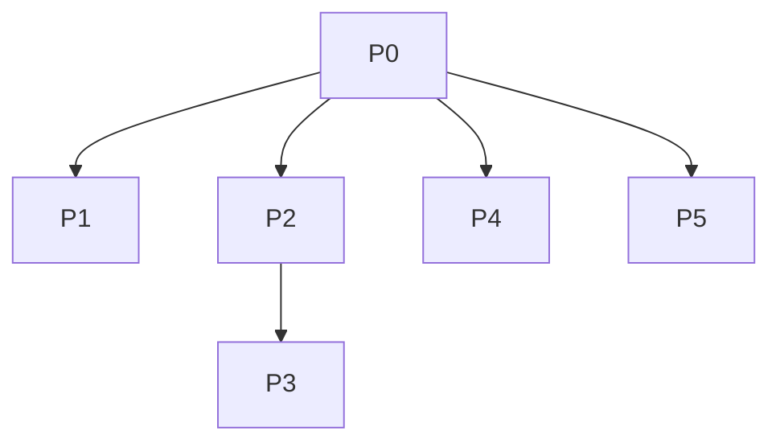

# CLI TUI v2 — Dev Plan

> **Plan Gate 文档**（给人审阅）。结构化约束见 [spec.json](./spec.json)；可执行实现指令见 [cli-tui-v2-worker-prompt.md](../../cli-tui-v2-worker-prompt.md)。
> Task: [T002.json](../../tasks/T002.json) · 决策: [decision-record.json](./decision-record.json)

**状态**: approved · **Task**: T002 · **Spec**: cli-tui-v2

---

## 目标

在 `forward-market-intel` MVP 之上，升级 `trader-cli` 为 ink TUI 主界面，并补齐：

- 报表/市场数据缓存（省 LLM 与 yfinance 配额）
- 新闻三源爬取（RSS / API / Web → `events` 表）
- 服务生命周期管理（Windows + macOS）
- ASCII K 线图、探索发现（pattern / cross-asset / anomaly dashboard）
- LLM 迭代推理（`related_hypotheses` 业务记录 + chat 会话内存，两套独立机制）

**不改动**：`app/modules/`、`app/core/`、`trader-cockpit/`、旧 `trader-agent.db`。

---

## Phase 计划

| Phase | 内容 | 依赖 | 阻塞验收 |
|---|---|---|---|
| **P0** | ink TUI 框架（Sidebar / ContentArea / StatusBar / HotkeyBar） | — | V101 |
| **P1** | ChatPage + `related_hypotheses` 注入 + `chat --eval` 保留 | P0 | V102 |
| **P2** | `report_cache` + 市场 TTL short-circuit | P0 | V104, V105, V108 |
| **P3** | pattern_matcher + cross_asset + anomaly_dashboard | P2 | V110 |
| **P4** | ASCII K 线 + `trader server` | P0 | V107 |
| **P5** | 新闻爬虫 + data/config 子命令 | P0 | V106 |

P0 完成后 P1/P2/P4/P5 可并行；P3 依赖 P2。

---

## 关键架构决策（摘要）

| ID | 决策 |
|---|---|
| D101 | ink v7 + Commander.js 共存 |
| D102 / D108 | 业务记录（hypotheses 表）与 chat messages 内存**两套独立** |
| D105 / D113 | report_cache 唯一键含 `latest_signal_ts`；check 时服务端实时算 MAX(ts) |
| D109 | TTL 内 **short-circuit HTTP**，不是只跳过 INSERT |
| D110 | `patterns.trigger_sql` 必须 migration 后 UPDATE 回填 5 条 seed |
| D111 | cross_asset / pattern_matcher **不进** SCANNERS registry |
| D112 | `chat --eval` 走旧 readline，无参数 chat 进 TUI |
| D114 | schema 演进只用 `schema.py` + `_migrate_*_columns`，无 migrations_v2 |

完整 rationale → [decision-record.json](./decision-record.json)

---

## 主要交付物

**CLI 新建**

- `apps/trader-cli/src/tui/**`
- `commands/report.ts`, `chart.ts`, `server.ts`, `data.ts`, `config.ts`

**后端新建**

- `app/intel/api/report_cache.py`, `news.py`
- `app/intel/ingestion/news_crawler.py`
- `app/intel/features/pattern_matcher.py`, `cross_asset.py`
- 测试: `test_intel_cache_*.py`, `test_intel_news_crawler.py`, `test_intel_pattern_matcher.py`

**后端修改**

- `schema.py`（report_cache 表 + ingested_at + trigger_sql migrations）
- `context.py`, `hypotheses.py`, `signals.py`, `market_data.py`, `api/__init__.py`

---

## 风险与缓解

| 风险 | 缓解 |
|---|---|
| `init_intel_db` migration 写错导致现有 intel 测试全红 | 改 schema.py 后必跑 `test_intel_phase0_schema.py` + `test_intel_phase6_postmortem.py` |
| `patterns.trigger_sql` 未回填 → pattern_matcher 静默失效 | D110 + V110 断言 5 条 MVP_PATTERNS 非 NULL |
| ink TUI 破坏 `chat --eval` CI smoke | D112 分流；V109 验 --eval 路径 |
| TTL 只跳过 INSERT 仍打 yfinance | D109 + V108 mock 断言 0 HTTP calls |
| `tools.ts` 中文 mojibake | Worker Prompt Step 0 先修编码再 P1 |

---

## Plan Gate 检查清单

- [ ] scope.forbidden 路径前缀为 `apps/trader-agent/backend/app/...`（非裸 `app/`）
- [ ] 所有 modify 文件已在 spec.json 列出（含 `api/__init__.py`, `signals.py`, `hypotheses.py`）
- [ ] blocking verification 8 条（V101/V102/V104/V105/V106/V107/V108/V110）有对应 pytest 或 CLI 命令
- [ ] 实现细节以 [cli-tui-v2-worker-prompt.md](../../cli-tui-v2-worker-prompt.md) 为准，本 plan 不重复代码块

---

## 开工顺序（推荐）

1. **P0** — TUI 骨架 + Commander 集成
2. **P2** — 缓存（后端价值最大，且 P3 依赖）
3. **P1** — Chat TUI（Step 0 修 tools.ts 编码）
4. **P4 / P5** — 可并行
5. **P3** — 最后（依赖 P2 + scanner 响应扩展）

实现时交给 Cursor Composer，引用 worker prompt + spec.json + code_map。
