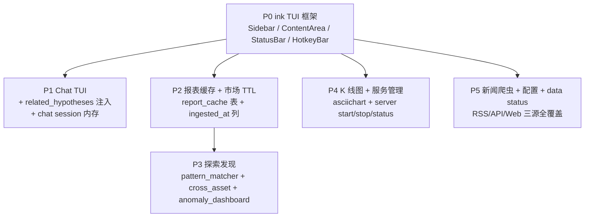
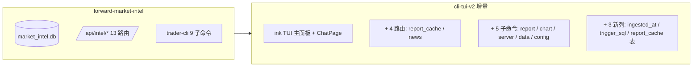

# CLI TUI v2 — Spec

> 双文件原则：本文件给人类审阅。结构化约束在 [spec.json](./spec.json)。决策完整 rationale 在 [decision-record.json](./decision-record.json)。
> JSON Schema: [.agent-dev/memory/schemas.md §2](../../memory/schemas.md)

---

## 背景与动机

`trader-cli` 当前是无状态命令行（scan / analyze / chat 等独立子命令），父 spec `forward-market-intel` MVP 已完成的能力点足够多，但缺少：

1. **持续渲染的主面板** — 让用户看到 signals/lessons/health 实时视图
2. **报表生成的成本控制** — LLM 报表生成成本高，同一天重复请求需要缓存
3. **新闻源的结构化入口** — 现有 events 表只有 ARK 和手工录入两类 source，缺日常新闻流入
4. **服务生命周期管理** — 当前 `npm run trader-agent:backend:dev` 出问题只能去 PowerShell 杀进程
5. **TUI 的对话连贯性** — 现有 `chat` 是单论 readline，跨轮的 messages 无法注入到下一次 generateText

本 spec 在保留所有现有 CLI 子命令的前提下，引入 ink TUI、报表/数据缓存、新闻爬虫、服务管理子命令、ASCII K 线图，并把 hypotheses 表的历史记录通过 context/build 反哺给 LLM 形成迭代式推理。

---

## 边界总览（5 个 phase）

P0 是强前提；P1-P5 在 P0 完成后可并行（除 P3 依赖 P2 的 cache 概念）。详见 [task.json](../../tasks/T002.json) `steps[].depends_on`。

---

## 架构决策详解

14 条决策（D101-D114），按主题分组：

| 主题 | 决策 ID | 一句话 |
|---|---|---|
| **TUI 框架** | D101 | ink v7 + Commander.js 共存（TUI 入口仅 trader / chat） |
| **chat 行为** | D108, D112 | 客户端 messages 内存 20 轮；`chat --eval` 走旧 readline 路径 |
| **业务记录注入** | D102, D115（含于 D102） | context/build 注入 related_hypotheses，跟 chat 内存独立 |
| **报表缓存** | D105, D113 | `(symbol, date, latest_signal_ts)` 唯一键，服务端实时 join 失效 |
| **市场数据 TTL** | D109 | TTL 内 short-circuit HTTP，不调 yfinance |
| **探索发现** | D110, D111 | `patterns.trigger_sql` 必须显式回填；cross_asset/pattern_matcher 不进 SCANNERS |
| **新闻爬取** | D103 | RSS + API + Web 全覆盖 → events.source_type='news' |
| **服务管理** | D106 | Windows + macOS 跨平台（process.platform 分支） |
| **K 线图** | D107 | asciichart + market_bars，无额外 HTTP |
| **Schema 演进** | D114 | 沿用 schema.py 单文件 + `_migrate_*_columns` 模式 |
| **Phase 依赖** | D104 | P0 是强前提，P1-P5 并行 |

完整 rationale + alternatives + revisit_when 见 [decision-record.json](./decision-record.json)。

---

## 验收标准详解

11 条 acceptance（A101-A111），映射到 10 条 verification（V101-V110）。`blocking=true` 的有 V101/V102/V104/V105/V106/V107/V108/V110，必须全过才能 merge。

详见 [spec.json](./spec.json) `acceptance` + `verification`。

### 容易漏掉的边界条件

| 检查项 | 为什么强调 |
|---|---|
| V108 mock yfinance 断言 **0 calls** | A108 真实诉求是省 HTTP 配额，不是省 DB INSERT。仅检查 DB 行数不能证明 TTL 真的 short-circuit 了 |
| V110 检查 5 条 MVP_PATTERNS 的 trigger_sql 均非 NULL | INSERT OR IGNORE 不会更新已存在行；必须确认 _migrate_pattern_trigger_sql 真的跑了 UPDATE |
| V109 用 `chat --eval` 而非 TUI | TUI 没法在 CI 里 assert 输出；--eval 路径必须保留就是为了这种验证 |
| V104 第二次 report 提示 `[缓存命中]` | 需要 CLI 端在命中时打印明确标志，否则只看耗时不能区分 cache 命中和 LLM 偶然快 |

---

## Non-Goals 说明

详见 [spec.json](./spec.json) `non_goals` 字段。重点强调：

- **不做 GUI 桌面应用** — TUI 已是终极交互上限
- **不做 WebSocket 实时推送** — scan / status 端点足够
- **不支持 Linux 平台的 server 管理** — Windows + macOS 覆盖当前所有开发者；Linux 等部署需求出现再补
- **不做复杂新闻 NLP** — events.raw_text 直接给 LLM 消费，不引入 spaCy/BERT 之类的中间层

---

## 与父 spec 的边界关系

本 spec **只增不改**父 spec 已有功能。共享的 `app/modules/`、`app/core/`、旧 `trader-agent.db` 全部在 forbidden 列表，与父 spec D010 边界一致。

---

## 相关文档

- Dev Plan（Plan Gate）: [dev-plan.md](./dev-plan.md)
- Worker Prompt（实现指令）: [cli-tui-v2-worker-prompt.md](../../cli-tui-v2-worker-prompt.md)
- 父 Spec: [.agent-dev/specs/forward-market-intel/spec.json](../forward-market-intel/spec.json)
- Task: [.agent-dev/tasks/T002.json](../../tasks/T002.json)
- 决策记录: [decision-record.json](./decision-record.json)
- Code Map: [.agent-dev/context/code_map.md](../../context/code_map.md)
- 系统设计: [project-docs/legacy/forward-intel/01-forward-market-intelligence-system-design.md](../../../project-docs/legacy/forward-intel/01-forward-market-intelligence-system-design.md)
