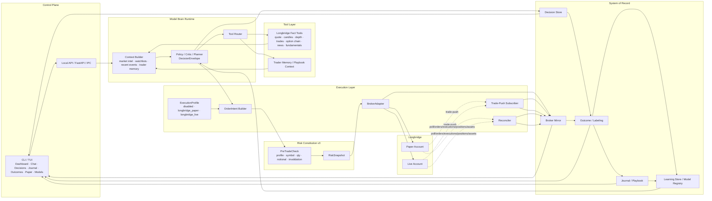
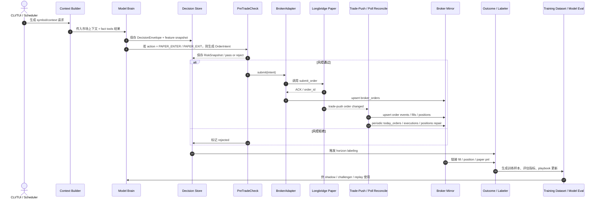
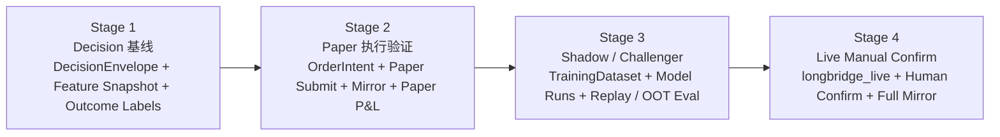

# 顶级交易员 Agent 核心系统蓝图

本蓝图建议把项目当前阶段定位为**模型主脑驱动的交易决策学习系统**，而不是一上来就做重型 OMS/EMS、多人平台或完备实盘中台。Longbridge 官方已经提供 paper trading sandbox、订单/成交/持仓/账户/交易推送等能力，且模拟撮合基于真实市场买卖盘，因此当前最优路线是把精力集中在 **Decision → Execution Intent → Mirror → Outcome → Learning** 的闭环上，而不是重复造券商基础设施。citeturn7search0turn10search2turn10search1turn11search0turn11search1turn15search0

这份方案同时保留扩展到实盘的接口边界：`ExecutionProfile`、`OrderIntent`、`BrokerAdapter`、`BrokerMirror` 与 `Model Registry` 从第一天就存在，但当前阶段只把 `longbridge_paper` 做到可用、可回放、可复盘。Longbridge 的 paper 与 live 在交易权限上通过不同 Access Token 区分，而报价权限与 App Key / Secret 关联，这使得“同一执行抽象、不同 profile”成为当前最自然的工程边界。citeturn10search3turn11search2turn10search1

在治理层面，方案主张**轻治理但不断证据化**：参考 2026 年更新的模型风险管理指导，模型治理应采取与风险画像和复杂度相称的做法；同时，SR 11-7 及 OCC 指南仍强调模型开发、验证、持续监控与 outcomes analysis 的必要性。因此当前阶段不需要做重型 secrets 管理、多用户权限或完备审计，但必须把模型决策、特征快照、结果标签和评估记录保存为系统资产。citeturn9search2turn9search0turn9search1

## 项目目标与终态假设

这份设计建立在以下明确假设之上，这些假设来自你给定的项目边界，而不是通用企业平台假设。

| 维度 | 当前假设 | 架构含义 |
|---|---|---|
| 使用形态 | 单用户 / 小团队 | 不做复杂多租户、RBAC、组织级审批中心 |
| 部署方式 | 本地部署优先 | 首选 SQLite 友好 schema，本地 FastAPI + CLI/TUI |
| Broker | Longbridge 为首选 paper/live 后端 | 执行抽象围绕 Longbridge API 与 trade-push 设计 |
| 控制面 | CLI/TUI 优先 | Web Cockpit 不作为当前主线 |
| 安全范围 | 暂不优先 secrets 管理 | 只保留基本环境变量约束，不设计重型凭证中台 |
| 执行目标 | 当前重点是 paper，未来扩展到 live | `ExecutionProfile` 先做 `disabled/paper/live` 三态 |
| 风控范围 | 仅做简化版 Risk Constitution | 当前只做 submit-path 的最小 PreTradeCheck |
| 数据目标 | 决策、结果、复盘、学习闭环优先 | Decision Store / Outcome / Journal / Model Eval 为核心资产 |

终态假设不是“一个什么都管的交易平台”，而是一个**用统一对象和统一数据库贯通 replay、paper、shadow 与 live-manual 的本地系统**。其核心资产不是 Token 管理中心或完整证券后台，而是持续积累的 **Decision Corpus、Outcome Corpus、Journal、Playbook Stats 与 Model Evaluations**。这与成熟量化框架强调的“信号、风险、执行、组合职责分离”是一致的，只是当前阶段把 `Universe`、`Portfolio Construction` 与 `Sizing` 收敛到 Model Brain 内部，以降低第一阶段复杂度。citeturn18search1

同时，实盘扩展的前提不是“补更多功能”，而是保持**同一路径、不同 profile**。NautilusTrader 的官方文档把同一套订单与风险路径贯穿回测、sandbox 和 live；SEC Rule 15c3-5 与 FINRA 也都把 pre-trade controls 视作交易系统的基本约束。因此本蓝图在当前阶段只做简化版 Risk Constitution，但要求其始终位于 `OrderIntent` 与 `BrokerAdapter` 之间。citeturn8search1turn8search5turn8search2

## 系统分层架构图

Longbridge 官方文档已经把行情、基本面、资讯、市场数据、交易、资产、账户等 API 家族清晰拆开；这给本项目一个非常直接的启示：**Tool Layer 只做事实查询，Execution Layer 只做交易与账户状态**。当前阶段不应让模型通过“工具调用”直接下单，而应让模型先生成 `DecisionEnvelope`，再由执行层把它转成 `OrderIntent`，经过简化风控后提交给 Longbridge paper。citeturn16view0turn10search1turn11search2



上图里有两个关键设计判断。第一，**Decision Store 才是系统主轴**：所有模型判断先落库，再决定是否进入执行层。第二，**Broker Mirror 是本地真相层**：即使订单与成交发生在 Longbridge，系统仍然要把 order、fill、position 与 account 状态镜像到本地数据库，否则就无法做 outcome labeling、paper 绩效分析和训练集构建。Longbridge 已提供当日订单、订单详情、当日成交、股票持仓、账户资金和交易推送接口，因此当前阶段完全没有必要自建重型 OMS；一个“薄执行适配器 + 厚本地镜像层”就足够。citeturn11search5turn12search2turn15search0turn11search0turn11search1turn10search1

## 模块职责、关键对象与数据模型

下表给出当前阶段但可扩展到 live 的模块边界。它不是“功能越多越好”的罗列，而是围绕闭环构建的最小专业架构。

| 模块 | 当前职责 | 最小接口 | 当前阶段边界 |
|---|---|---|---|
| Control Plane | 命令输入、状态展示、人工确认 | `renderDecision()` / `renderPaperState()` / `confirmLiveIntent()` | 只做 CLI/TUI，不做 Web |
| Model Brain Runtime | 从 context 生成结构化判断 | `evaluate(context) -> DecisionEnvelope` | 先做单模型主脑，可带 Critic 字段 |
| Tool Layer | 查询客观事实与上下文资料 | `quote()` / `bars()` / `news()` / `fundamentals()` / `optionChain()` | 只读，不允许工具直接下单 |
| Risk Constitution v0 | 执行前最小检查并产出 RiskSnapshot | `check(intent) -> RiskSnapshot` | 只做 submit-path 简化检查 |
| Execution Layer | 将判断转为订单意图并提交 broker | `submit/cancel/replace/query/subscribe` | 先实现 `longbridge_paper` |
| Decision Store | 保存模型判断与特征快照 | `saveDecision()` / `saveFeatureSnapshot()` | 所有判断必须落库 |
| Broker Mirror | 同步订单、成交、持仓、资产快照 | `upsertOrder()` / `appendFill()` / `snapshotPositions()` | trade-push + polling 双通道 |
| Outcome / Labeling | 计算回报、MFE/MAE、失效标签 | `labelDecision()` / `linkFillOutcome()` | 先做 horizon labels + paper P&L |
| Journal / Playbook | 记录人工反馈、标签、失败原因、玩法统计 | `appendJournal()` / `updatePlaybookStats()` | 先做 v0 标签化 |
| Learning Store / Model Registry | 训练集、模型运行、模型评估、Champion/Challenger | `buildDataset()` / `recordRun()` / `recordEval()` | 当前先做最小 registry |

**关键对象 TS 定义示例**

```ts
export type DecisionAction =
  | "NO_TRADE"
  | "WATCH"
  | "WAIT_TRIGGER"
  | "PREPARE_TRADE_CANDIDATE"
  | "PAPER_ENTER"
  | "PAPER_EXIT"
  | "INVALIDATE";

export interface DecisionEnvelope {
  decision_id: string;
  ts: string;                 // ISO8601
  symbol: string;             // TSLA.US
  model_provider: string;     // deepseek | ollama | anthropic | openrouter
  model_name: string;
  model_version: string;
  action: DecisionAction;
  confidence: number;         // 0~1
  uncertainty: number;        // 0~1
  belief_state: {
    market_regime: string;    // trend_up / range / risk_off ...
    setup_state: string;      // breakout_watch / failed_breakout / pullback ...
    playbook_key?: string;
    direction_bias?: "long" | "short" | "neutral";
  };
  trade_plan?: {
    direction: "long" | "short";
    instrument: "stock" | "call" | "put" | "call_spread" | "put_spread" | "avoid_options";
    entry_trigger: string;
    invalidation: string;
    stop_plan?: string;
    target_plan?: string[];
    sizing_hint?: string;
  };
  evidence: string[];
  objections: string[];
  missing_evidence: string[];
  raw_context_ref?: string;
}

export interface RiskSnapshot {
  risk_snapshot_id: string;
  decision_id: string;
  profile_id: "disabled" | "longbridge_paper" | "longbridge_live";
  passed: boolean;
  checks: {
    profile_allowed: boolean;
    symbol_allowed: boolean;
    quantity_valid: boolean;
    max_notional_ok: boolean;
    invalidation_present: boolean;
    decision_linked: boolean;
  };
  max_order_notional_usd?: number;
  computed_notional_usd?: number;
  reasons: string[];
  created_at: string;
}

export interface OrderIntent {
  intent_id: string;
  decision_id: string;
  risk_snapshot_id: string;
  profile_id: "longbridge_paper" | "longbridge_live";
  symbol: string;
  side: "Buy" | "Sell";
  order_type: "LO" | "MO" | "LIT" | "MIT";
  submitted_quantity: string;
  submitted_price?: string;
  trigger_price?: string;
  time_in_force: "Day" | "GTC" | "GTD";
  outside_rth?: "RTH_ONLY" | "ANY_TIME" | "OVERNIGHT";
  remark?: string;
  reason: string;
  idempotency_key: string;
}
```

**对象 JSON 示例**

```json
{
  "decision_id": "dec_20260601_tsla_001",
  "ts": "2026-06-01T14:35:00Z",
  "symbol": "TSLA.US",
  "model_provider": "deepseek",
  "model_name": "deepseek-r1",
  "model_version": "2026-05-30",
  "action": "WAIT_TRIGGER",
  "confidence": 0.72,
  "uncertainty": 0.18,
  "belief_state": {
    "market_regime": "trend_up",
    "setup_state": "breakout_watch",
    "playbook_key": "us_leader_first_pullback",
    "direction_bias": "long"
  },
  "trade_plan": {
    "direction": "long",
    "instrument": "stock",
    "entry_trigger": "突破 251.20 且 5m 成交量放大",
    "invalidation": "回落并有效跌破 247.80",
    "stop_plan": "247.60 下方离场",
    "target_plan": ["255.80", "259.50"]
  },
  "evidence": [
    "盘前强势",
    "相对 QQQ 强",
    "关键位上方收敛"
  ],
  "objections": [
    "市场整体波动率抬升"
  ],
  "missing_evidence": [
    "触发前尚未出现突破量"
  ]
}
```

Longbridge 使用 `symbol`、`order_type`、`submitted_price`、`submitted_quantity`、`trigger_price`、`side`、`outside_rth`、`time_in_force`、`remark` 等下单字段；订单、成交、持仓和账户接口分别返回 `order_id`、`status`、`executed_quantity`、`executed_price`、`trade_id`、`available_quantity`、`cost_price`、`buy_power` 等字段。因此 `OrderIntent` 与 Broker Mirror 的字段设计应尽量直映官方 schema，而不是重造抽象名称。citeturn11search2turn12search2turn15search0turn17view0turn11search1

**SQLite-friendly SQL 表结构示例**

```sql
CREATE TABLE IF NOT EXISTS model_decisions (
  id TEXT PRIMARY KEY,
  ts INTEGER NOT NULL,
  symbol TEXT NOT NULL,
  model_provider TEXT NOT NULL,
  model_name TEXT NOT NULL,
  model_version TEXT NOT NULL,
  action TEXT NOT NULL,
  confidence REAL NOT NULL,
  uncertainty REAL NOT NULL,
  belief_state_json TEXT NOT NULL,
  trade_plan_json TEXT,
  evidence_json TEXT,
  objections_json TEXT,
  missing_evidence_json TEXT,
  decision_json TEXT NOT NULL,
  status TEXT NOT NULL DEFAULT 'proposed',
  created_at INTEGER NOT NULL
);

CREATE TABLE IF NOT EXISTS decision_feature_snapshots (
  id TEXT PRIMARY KEY,
  decision_id TEXT NOT NULL,
  symbol TEXT NOT NULL,
  asof_ts INTEGER NOT NULL,
  context_json TEXT NOT NULL,
  features_json TEXT NOT NULL,
  created_at INTEGER NOT NULL,
  FOREIGN KEY (decision_id) REFERENCES model_decisions(id)
);

CREATE TABLE IF NOT EXISTS decision_outcomes (
  id TEXT PRIMARY KEY,
  decision_id TEXT NOT NULL,
  symbol TEXT NOT NULL,
  horizon_code TEXT NOT NULL,          -- 30m / 1h / eod / 1d / 3d
  reference_price REAL NOT NULL,
  future_price REAL,
  return_pct REAL,
  mfe_pct REAL,
  mae_pct REAL,
  hit_invalidation INTEGER DEFAULT 0,
  hit_target_proxy INTEGER DEFAULT 0,
  paper_pnl REAL,
  outcome_json TEXT,
  created_at INTEGER NOT NULL,
  FOREIGN KEY (decision_id) REFERENCES model_decisions(id)
);

CREATE TABLE IF NOT EXISTS journal_entries (
  id TEXT PRIMARY KEY,
  decision_id TEXT,
  symbol TEXT NOT NULL,
  source TEXT NOT NULL,                -- human / model / postmortem
  decision TEXT NOT NULL,              -- accept / reject / watch / override
  rationale TEXT,
  tags_json TEXT,
  failure_reason TEXT,
  created_at INTEGER NOT NULL,
  FOREIGN KEY (decision_id) REFERENCES model_decisions(id)
);

CREATE TABLE IF NOT EXISTS paper_order_intents (
  id TEXT PRIMARY KEY,
  decision_id TEXT NOT NULL,
  risk_snapshot_json TEXT NOT NULL,
  profile_id TEXT NOT NULL,            -- longbridge_paper / longbridge_live
  symbol TEXT NOT NULL,
  side TEXT NOT NULL,
  order_type TEXT NOT NULL,
  submitted_quantity TEXT NOT NULL,
  submitted_price TEXT,
  trigger_price TEXT,
  time_in_force TEXT NOT NULL,
  outside_rth TEXT,
  remark TEXT,
  reason TEXT NOT NULL,
  idempotency_key TEXT NOT NULL,
  status TEXT NOT NULL DEFAULT 'created',
  created_at INTEGER NOT NULL,
  FOREIGN KEY (decision_id) REFERENCES model_decisions(id)
);

CREATE TABLE IF NOT EXISTS broker_orders (
  id TEXT PRIMARY KEY,
  intent_id TEXT,
  decision_id TEXT,
  broker TEXT NOT NULL,                -- longbridge
  profile_id TEXT NOT NULL,
  broker_order_id TEXT NOT NULL,
  symbol TEXT NOT NULL,
  side TEXT NOT NULL,
  order_type TEXT NOT NULL,
  status TEXT NOT NULL,
  quantity TEXT NOT NULL,
  executed_quantity TEXT,
  price TEXT,
  executed_price TEXT,
  time_in_force TEXT,
  outside_rth TEXT,
  submitted_at INTEGER,
  updated_at INTEGER,
  remark TEXT,
  raw_json TEXT NOT NULL,
  created_at INTEGER NOT NULL
);

CREATE TABLE IF NOT EXISTS broker_fills (
  id TEXT PRIMARY KEY,
  broker TEXT NOT NULL,
  profile_id TEXT NOT NULL,
  broker_order_id TEXT NOT NULL,
  trade_id TEXT NOT NULL,
  symbol TEXT NOT NULL,
  price TEXT NOT NULL,
  quantity TEXT NOT NULL,
  trade_done_at INTEGER NOT NULL,
  raw_json TEXT NOT NULL,
  created_at INTEGER NOT NULL
);

CREATE TABLE IF NOT EXISTS broker_positions_snapshots (
  id TEXT PRIMARY KEY,
  profile_id TEXT NOT NULL,
  account_channel TEXT,
  snapshot_at INTEGER NOT NULL,
  symbol TEXT NOT NULL,
  symbol_name TEXT,
  quantity TEXT NOT NULL,
  available_quantity TEXT,
  cost_price TEXT,
  currency TEXT,
  market TEXT,
  init_quantity TEXT,
  raw_json TEXT NOT NULL,
  created_at INTEGER NOT NULL
);

CREATE TABLE IF NOT EXISTS model_registry (
  id TEXT PRIMARY KEY,
  model_name TEXT NOT NULL,
  model_version TEXT NOT NULL,
  role TEXT NOT NULL,                  -- champion / challenger / retired
  provider TEXT NOT NULL,
  schema_version TEXT NOT NULL,
  status TEXT NOT NULL,                -- active / shadow / disabled
  created_at INTEGER NOT NULL
);

CREATE TABLE IF NOT EXISTS model_runs (
  id TEXT PRIMARY KEY,
  model_registry_id TEXT,
  run_type TEXT NOT NULL,              -- train / shadow / paper / eval
  dataset_ref TEXT,
  params_json TEXT,
  metrics_json TEXT,
  notes TEXT,
  created_at INTEGER NOT NULL,
  FOREIGN KEY (model_registry_id) REFERENCES model_registry(id)
);

CREATE TABLE IF NOT EXISTS model_evaluations (
  id TEXT PRIMARY KEY,
  model_run_id TEXT NOT NULL,
  evaluation_type TEXT NOT NULL,       -- paper, shadow, replay, oot
  window_start INTEGER,
  window_end INTEGER,
  cohort_key TEXT,
  metrics_json TEXT NOT NULL,
  verdict TEXT,                        -- pass / fail / review
  created_at INTEGER NOT NULL,
  FOREIGN KEY (model_run_id) REFERENCES model_runs(id)
);

CREATE TABLE IF NOT EXISTS playbook_stats (
  id TEXT PRIMARY KEY,
  playbook_key TEXT NOT NULL,
  symbol_scope TEXT,
  market_regime TEXT,
  sample_size INTEGER NOT NULL DEFAULT 0,
  win_rate_proxy REAL,
  avg_return_pct REAL,
  avg_mfe_pct REAL,
  avg_mae_pct REAL,
  common_failures_json TEXT,
  updated_at INTEGER NOT NULL
);
```

这组表的设计目标很明确：`model_decisions` 与 `decision_feature_snapshots` 解决“当时模型看到了什么”；`broker_orders`、`broker_fills` 与 `broker_positions_snapshots` 解决“实际发生了什么”；`decision_outcomes`、`journal_entries` 与 `playbook_stats` 解决“后来到底对不对、为什么对/错”；`model_runs` 与 `model_evaluations` 解决“下一个模型是否真的更好”。这正对应 SR 11-7 与 OCC 对模型开发、验证、治理、持续监控和 outcomes analysis 的要求。citeturn9search0turn9search1

## Longbridge 集成设计

Longbridge 是当前阶段最合适的首选 broker 后端，原因不是“接口多”这么简单，而是它已经同时提供了三种当前阶段最需要的能力：第一，paper account 可以在不开真实证券账户的情况下完成行情与交易联调；第二，paper 账户支持港美股、ETF、港股轮证和美股期权，美股支持做空；第三，官方同时提供下单、改单、撤单、订单查询、成交查询、持仓、账户资产以及 trade-push 订阅，使得本地只需要实现一层薄适配器和镜像层。citeturn10search3turn10search2turn11search2turn11search5turn12search2turn12search3turn15search0turn11search0turn11search1turn10search1

Longbridge 的 paper 与 live 建议用一个统一的 `ExecutionProfile` 抽象来表示，而不要把差异散落在业务代码里。

| Profile | 说明 | 当前阶段 | 备注 |
|---|---|---|---|
| `disabled` | 不允许执行，只做 Decision / Outcome | 默认可用 | 用于研究与回放 |
| `longbridge_paper` | Longbridge 模拟账户 | 当前主实现 | 真实市场数据 + 模拟撮合 |
| `longbridge_live` | Longbridge 真实账户 | 仅预留接口 | 只在 Stage4 开启人工确认 |

Longbridge 官方明确说明：模拟账户和真实账户**共用 App Key / Secret，但使用不同 Access Token**；行情权限与 App Key / Secret 关联，交易权限与 Access Token 关联。因此在代码结构上，paper 与 live 应共享 `BrokerAdapter` 接口，但在 profile 选择与 UI 提示层清晰区分。citeturn10search3

**BrokerAdapter 与官方 API 的最小映射**

| 本地适配器方法 | 官方接口 | 当前用途 | 来源 |
|---|---|---|---|
| `submitOrder(intent)` | `POST /v1/trade/order` | 提交 paper/live 订单 | citeturn11search2 |
| `replaceOrder(orderId, patch)` | `PUT /v1/trade/order` | 改价/改量 | citeturn5search1 |
| `cancelOrder(orderId)` | `DELETE /v1/trade/order` | 撤单 | citeturn12search3 |
| `todayOrders(filter)` | `GET /v1/trade/order/today` | 订单镜像/重建状态 | citeturn11search5 |
| `orderDetail(orderId)` | `GET /v1/trade/order` | 获取历史、费用、最终状态 | citeturn12search2 |
| `todayExecutions(filter)` | `GET /v1/trade/execution/today` | 成交镜像 | citeturn15search0 |
| `stockPositions(symbols?)` | `GET /v1/asset/stock` | 持仓快照 | citeturn11search0turn17view0 |
| `accountBalance(currency?)` | `GET /v1/asset/account` | 账户与购买力快照 | citeturn11search1 |
| `estimateMaxPurchaseQuantity()` | `GET /v1/trade/estimate/buy_limit` | 简化版下单前尺寸运算 | citeturn13search1 |
| `subscribeTradePush(handler)` | trade-push `private` topic | 实时订单变化回流 | citeturn10search1turn3view0 |

Trade-push 的设计应遵循“双通道镜像”原则：同步通道把 submit/replace/cancel 的 ACK 立即写入 `broker_orders`；异步通道订阅 `private` topic，通过 `set_on_order_changed` / `OnTrade` 回调接收订单变化，更新 `broker_orders` 与 `broker_fills`；修复通道则周期性调用 `today_orders`、`order_detail`、`today_executions`、`stock_positions` 和 `account_balance` 做 reconcile，修复漏推送、网络闪断或客户端重启造成的状态缺口。官方文档已经提供了这三类机制，所以本地执行层无需重造交易网关协议。citeturn10search1turn11search5turn12search2turn15search0turn11search0turn11search1

关于 paper 规则，有三条必须写进系统默认值。第一，模拟账户目前**不支持美股盘前盘后，也不支持 OTC**；第二，模拟撮合参考真实买卖盘，买价高于等于卖一、卖价低于等于买一即可撮合，市价单默认可成交；第三，官方不建议自行推算可买数量，而是调用 `/v1/trade/estimate/buy_limit`，因为底层风控逻辑较复杂。由此推论，当前阶段最好只开放 `RTH_ONLY + whitelist symbols + LO/MO + 小额名义金额` 这组 paper profile 默认值。citeturn10search2turn13search1

另一个容易被忽略的点是**权限感知**。Longbridge 的 OpenAPI 行情权限独立于 App/Web，基础行情可用，但更完整的美股盘前盘后、夜盘或美股期权行情需要额外市场数据权限。因此 Tool Layer 在 TUI 中需要能显示“权限缺失”与“数据降级”，而不是把缺失数据默认为 0。citeturn7search3turn15search2turn10search4

## 数据闭环与验证路径

这套系统的核心不在“模型输出了什么”，而在**模型输出之后发生了什么**。监管和行业最佳实践都把 outcomes analysis、ongoing monitoring 和 effective challenge 视作模型治理核心，因此本项目的数据闭环必须从第一阶段就把“决策、执行、结果、复盘、评估”串起来。citeturn9search0turn9search1



在执行验证上，推荐采用四阶段门控，而不是“一步到位 live 自动交易”。这既符合 Longbridge paper/live 的天然边界，也符合 2026 修订版模型风险管理导向的“按风险画像分层治理”原则。citeturn9search2turn10search3



| 阶段 | 核心目标 | 必要产出 | 建议验收指标 |
|---|---|---|---|
| Stage 1 | 决策成为结构化资产 | `model_decisions`、`decision_feature_snapshots`、`decision_outcomes` | 100% 模型判断落库；95%+ 决策可生成 horizon outcome；TUI 能按 symbol / action / model_version 浏览 |
| Stage 2 | Paper 成为准真实执行环境 | `paper_order_intents`、`broker_orders`、`broker_fills`、`broker_positions_snapshots` | 100% paper 订单可追溯到 `decision_id`；订单 ACK 与推送状态可重建；至少 50 笔 paper 生命周期完整 |
| Stage 3 | 学习与评估闭环建立 | `model_runs`、`model_evaluations`、训练集构建脚本、shadow 推理 | 可进行 out-of-time / replay 评估；Champion/Challenger 可比较；confidence 与 outcome 有基本校准 |
| Stage 4 | 受控扩展到实盘人工确认 | `longbridge_live` profile、人工确认 UI、live mirror | 零“孤儿订单”；每笔 live intent 有 decision/risk/journal 链接；可随时切回 paper |

这里的 Promotion Gate 不建议现在就做成复杂服务，而建议做成一套**显式可读的规则表**。例如：`Stage2 -> Stage3` 需要 paper 镜像稳定且 outcome 完整；`Stage3 -> Stage4` 需要 replay / shadow 评估稳定、paper 最大回撤在阈值内、并且过去 N 天内没有未关联 decision 的订单。这样的 gate 既符合 SR 11-7 所要求的 outcomes analysis 和持续监控，也符合“当前阶段不做重型治理”的边界。citeturn9search0turn9search1turn9search2

## 开发路线、反面清单与最终交付物

当前阶段的开发路线应该围绕“先形成证据链，再谈智能化增强”来排优先级。Longbridge 已经把执行与账户所需的大部分底层能力提供好了，所以真正稀缺的是本地的决策对象、结果标签、镜像层与评估层。citeturn11search2turn11search5turn15search0turn11search0turn11search1turn10search1

| 任务 | 产出 | 验收标准 | 复杂度 |
|---|---|---|---|
| T006 | `DecisionEnvelope`、`model_decisions`、`decision_feature_snapshots`、Decisions 页面 | 任意一次模型判断都能结构化落库并回读 | 中 |
| T007 | `decision_outcomes`、`journal_entries`、Outcomes/Journal 页面 | 自动生成 30m/1h/EOD/1d 标签；支持人工标签与失败原因 | 中 |
| T008 | `ExecutionProfile`、`OrderIntent`、`LongbridgePaperAdapter` | 能在 `longbridge_paper` 下 submit/query/cancel | 中 |
| T009 | `broker_orders`、`broker_fills`、`broker_positions_snapshots`、trade-push 订阅、reconciler | 推送 + 轮询能重建订单/成交/持仓状态 | 高 |
| T010 | `PreTradeCheck v0`、`RiskSnapshot`、估算最大购买数量适配 | 无 `decision_id` / 无 invalidation / 超阈值订单不可提交 | 低 |
| T011 | Semantic event 抽取、`playbook_stats`、Playbook 页面 | 可按 playbook / regime / symbol 输出统计摘要 | 中 |
| T012 | Training dataset builder、`model_runs`、`model_evaluations`、Shadow 页面 | 可生成训练集与 shadow 评估结果 | 中 |
| T013 | Champion/Challenger、Replay CLI、Promotion Gate 规则文件 | 可比较两个模型在相同样本上的结果 | 中 |
| T014 | `longbridge_live` profile、Live Preview、人工确认页、回滚开关 | live 手动确认链路可用，但默认关闭自动提交 | 高 |

下面这些功能**现在不要做**，原因不是它们永远不需要，而是它们对当前阶段的闭环帮助最小，且会显著拖慢核心系统成型。

| 暂不做的功能 | 不做理由 |
|---|---|
| 完整 OMS / EMS | Longbridge 已提供订单、成交、持仓、资产、推送接口，当前用薄适配器即可 |
| 多用户 / 多租户 / RBAC | 当前假设是单用户或小团队，本地优先 |
| Secrets Manager / Token Vault | 当前不把 secrets 管理作为投入重点，基础环境变量已足够 |
| 完整合规审计日志系统 | 当前需要的是“可复盘的决策证据链”，不是企业级审计平台 |
| 复杂账户管理中心 | 先围绕一个 Longbridge broker profile 跑通闭环 |
| Web Cockpit | CLI/TUI 已是主控制面，Web 会分散产能 |
| 自动实盘交易 | 应在 Stage4 之后、且先从 live manual confirm 开始 |
| 多券商抽象 | 当前首选 broker 已明确，过早抽象会让接口失真 |
| 在线自我改规则 / RL 实盘 | 现阶段数据量与验证能力都不够，风险收益比极差 |

一个足够实用的 TUI 草图大致如下：

```text
┌ Top Trader Agent ─ PROFILE: LONGBRIDGE_PAPER ─ MODEL: deepseek-r1 ─ US ┐
│ [Dashboard] [Chat] [Decisions] [Journal] [Outcomes] [Paper] [Models]   │
├───────────────────────────── Left: Watchlist / Chart ───────────────────┤
│ TSLA.US  NVDA.US  QQQ.US  AAPL.US                                       │
│ 5m / 15m / 1h candle + key levels + recent events                       │
├──────────────────────────── Right: Decision Card ───────────────────────┤
│ action: WAIT_TRIGGER        confidence: 0.72                            │
│ regime: trend_up            playbook: us_leader_first_pullback          │
│ evidence: ...                                                         │
│ objections: ...                                                       │
│ trigger / invalidation / target plan                                  │
├──────────────────────────── Bottom: Paper / Outcome ────────────────────┤
│ intent #pi_001   order #lb_7788   status: PartialFilled                 │
│ fill: 20 @ 251.30   position: +20   pnl: +18.40                         │
│ journal tags: [good_selection, late_entry]                              │
└──────────────────────────────────────────────────────────────────────────┘
```

**最终交付物清单**

| 交付物 | 形式 | 内容 | 优先级 |
|---|---|---|---|
| 核心系统设计文档 | Markdown / README | 目标、假设、模块职责、边界、阶段门控 | P0 |
| Mermaid 架构图 | `.md` 内嵌 mermaid | 分层架构图、事件流图、Stage 门控图 | P0 |
| DB Schema 文档 | SQL + Markdown | 核心表、字段说明、迁移策略 | P0 |
| 关键对象规范 | TypeScript / JSON Schema | `DecisionEnvelope`、`OrderIntent`、`RiskSnapshot` | P0 |
| Longbridge 集成规范 | Markdown | profile 设计、API 映射、trade-push、mirror/reconcile | P0 |
| 本地 API 规范 | OpenAPI / Markdown | decisions, outcomes, paper orders, model eval endpoints | P1 |
| TUI 页面草图 | Markdown / ASCII / Figma 可后补 | Decisions / Outcomes / Paper / Models 页面布局 | P1 |
| 开发 Backlog | 表格 | T006–T014 任务、验收、复杂度 | P0 |
| 示例 JSON 样本 | `.json` | 典型 decision / intent / broker order / outcome 样本 | P1 |
| Replay / Shadow 说明文档 | Markdown | 如何从数据库回放、如何比较 champion/challenger | P1 |
| Migration 计划 | Markdown | SQLite → PostgreSQL 的兼容策略 | P2 |
| 反面清单文档 | Markdown | 当前不做什么、为什么不做 | P1 |

最终建议可以归结为一句话：**当前阶段把系统做成“本地部署的模型判断与执行学习中枢”，而不是“全功能交易平台”**。Longbridge 已经把 paper/live 执行底座、订单生命周期、资产持仓与 trade-push 提供出来；成熟框架也证明，信号、执行、风险与评估分层会显著提高可复用性；监管侧文档则反复强调 outcomes analysis、持续监控与按风险画像治理。因此，最值得投入的模块并不是账号管理、secrets 中台或完备 OMS，而是那些能让每一次判断都变成可验证资产的模块：Decision Store、Broker Mirror、Outcome Labeling、Journal、Playbook Stats 与 Model Evaluations。citeturn7search0turn16view0turn10search1turn18search1turn9search0turn9search1turn9search2