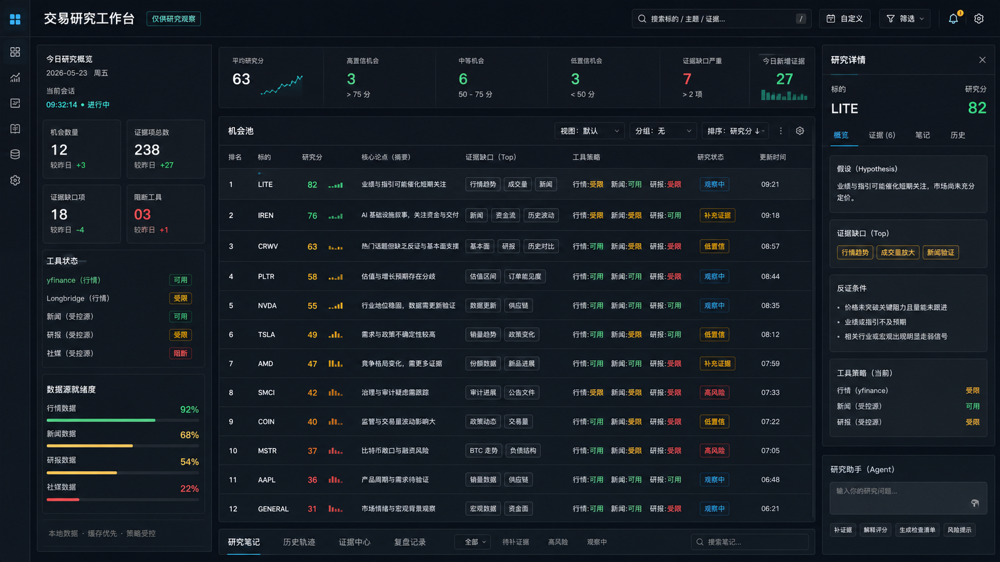

# Research Workbench Front-End Design Baseline

Date: 2026-05-23

## Conclusion

The research workbench should use an institutional dark terminal style with a research-notebook structure underneath.

The first screen prioritizes fast opportunity-pool scanning. The primary object is an Opportunity Blotter: a dense, sortable table of symbols, scores, thesis summaries, evidence gaps, tool-policy states, and research status.

The secondary object is a right-side Research Inspector for the selected opportunity. It shows hypothesis, missing evidence, invalidation conditions, evidence actions, and research-only boundary.

The Agent is not the visual center. It acts as an auxiliary layer for evidence refresh, explanation, and next-check generation.

Generated direction image:



## Why

The product goal is not to make a public content site or a trading order terminal. The workbench exists to compress community discussion into researchable observations, then force an evidence and falsification loop.

Therefore the interface must optimize for:

- scanning many observations quickly;
- seeing missing evidence before confidence rises;
- preserving a visible research-only boundary;
- making tool execution and blocked policy decisions auditable;
- keeping local-first sensitive data out of the browser payload.

Fortress is useful as a reference for dense institutional finance UI: sidebar taxonomy, compact metrics, dashboard panels, and blotter-like tables. But its order/trading language must not be copied into this product.

InvestIQ is useful for the opposing lesson: information density needs hierarchy and narrative context. Its strongest lesson is modular dashboard architecture, not visual style.

Pinterest is useful only as an evidence-board metaphor. Masonry cards can inspire a later Evidence Center, but they should not become the first-screen layout because they weaken ranking, comparison, and auditability.

## First-Screen Information Architecture

### Top Bar

Purpose: global session state.

Contents:

- title: `交易研究工作台`;
- selected day;
- session status;
- opportunity count;
- evidence count;
- blocked tool count;
- research-only badge.

### Left Sidebar

Purpose: system readiness and filters.

Contents:

- date selector;
- session state;
- context readiness;
- data-source readiness;
- tool policy states;
- filters for score, evidence gap, confidence, and status.

The sidebar should be compact and status-driven. It must not become a navigation-heavy enterprise menu.

### Center: Opportunity Blotter

Purpose: primary working surface.

Required columns:

- rank;
- symbol;
- score;
- confidence;
- thesis;
- evidence gap;
- source basis;
- invalidation status;
- research status;
- last evidence run.

Behavior:

- row selection updates the right inspector;
- missing evidence is visually stronger than high score;
- blocked tools are visible at row level when relevant;
- scores are presented as triage signals, not recommendations.

### Right: Research Inspector

Purpose: one selected opportunity as a research object.

Sections:

- hypothesis;
- supporting evidence;
- missing evidence;
- invalidation conditions;
- next checks;
- recent tool trace;
- quick action: refresh missing evidence.

The inspector is the research-notebook layer. It explains why the row exists and what would disprove it.

### Agent Layer

Purpose: assist the current selected opportunity.

Placement:

- compact docked panel or collapsible right-lower panel;
- not a permanent third-column wall when the screen is narrow.

Allowed visible tasks:

- explain why this opportunity exists;
- refresh missing evidence;
- summarize tool trace;
- produce next checks;
- prepare review note.

Disallowed visible tasks:

- trade execution language;
- target price;
- position sizing;
- order language;
- any direct instruction to buy, sell, long, or short.

## Visual Direction

### Style

- institutional dark cockpit;
- high density but not cramped;
- table-first;
- strong status color system;
- minimal decorative graphics;
- no marketing hero;
- no card-in-card composition.

### Palette

- background: charcoal / near black;
- panels: deep slate;
- text: off-white and muted blue-gray;
- positive / ready: teal green;
- informational: cyan;
- warning / missing evidence: amber;
- blocked / contradiction: muted red;
- borders: low-contrast slate.

### Typography

Use a clear UI sans for Chinese and English labels, plus a monospace face for tickers, scores, run IDs, and tool names.

Typography should support density. Avoid oversized hero type inside the app shell.

### Component Rules

- Tables and rows are primary.
- Status pills are used only for states.
- Evidence gaps use warning treatment.
- Tool states must be scannable with icon or dot + label.
- Buttons are command-focused: refresh evidence, inspect run, save review.
- Do not use decorative rounded cards as page sections.

## Alternatives Considered

### Alternative A: Pure Institutional Terminal

Pros:

- strongest professional feel;
- highest scanning density;
- aligns with the user's preferred visual direction.

Cons:

- can imply trading execution;
- can over-prioritize metrics over research reasoning;
- harder to keep research-only boundary visible.

Decision: use the visual density and dark-system language, but remove execution semantics.

### Alternative B: Research Notebook

Pros:

- strongest research boundary;
- easier to read;
- naturally supports hypothesis, evidence, falsification, and review.

Cons:

- weaker first-screen triage;
- lower perceived speed;
- less aligned with the user's preferred A direction.

Decision: use it as the inspector structure, not the full-page shell.

### Alternative C: Evidence Pinboard

Pros:

- useful for multi-source evidence collection;
- visually memorable;
- can support later evidence center and review surfaces.

Cons:

- poor ranking and comparison;
- weak audit sequence;
- risks becoming decorative.

Decision: defer to later Evidence Center or Review page patterns.

## Risks

- High scores may be misread as recommendations. Mitigation: evidence-gap prominence and repeated research-only boundary.
- Dark terminal aesthetics may imply execution capability. Mitigation: no order ticket, no execution verbs, no broker semantics.
- Dense layout can become unreadable. Mitigation: stable row heights, compact but clear typography, responsive fallback.
- Agent panel can dominate the workflow. Mitigation: Agent is contextual and collapsible, not primary.
- External references can push the product toward generic fintech UI. Mitigation: keep the first principle: evidence and falsification, not portfolio performance display.

## Acceptance Criteria

- First viewport clearly answers: what should I research first today?
- The largest visual area is the opportunity pool, not the Agent.
- The selected opportunity has a visible detail inspector.
- Missing evidence and invalidation status are more prominent than decorative metrics.
- Tool readiness and blocked policy states are visible without opening dev tools.
- No raw Markdown, raw JSON, absolute local paths, prompts, headers, environment variables, credentials, or provider raw payloads appear in browser-facing UI.
- No trade instruction language appears in visible product copy.
- Mobile and narrow desktop fall back to stacked sections without text overlap.

## Generated Image Prompt

```text
Use case: ui-mockup
Asset type: website concept image for a local trading research workbench
Primary request: Create a high-fidelity website UI mockup, not a functional screen, showing an institutional dark finance research dashboard inspired by professional terminals, with a research-notebook structure underneath.
Scene/backdrop: a full browser-window website screenshot mockup on a dark charcoal background.
Subject: the page is titled in Chinese: "交易研究工作台". The first screen focuses on an Opportunity Blotter: dense rows for symbols, score, thesis, evidence gap, tool policy, and research status. Right side has a Research Inspector with hypothesis, missing evidence, invalidation conditions, and a compact Agent action area. Left sidebar shows date, session status, evidence count, blocked tools, and data-source readiness.
Style/medium: polished product UI mockup, institutional finance dashboard, dark theme, high information density, precise spacing, sober professional look, similar discipline to Bloomberg/FactSet/Fortress-style enterprise dashboards but original.
Composition/framing: 16:9 wide desktop layout, three-column cockpit: narrow left status sidebar, large central opportunity table, medium right inspector panel; top bar with metrics; no marketing hero.
Lighting/mood: crisp, focused, serious, low-glare dark interface.
Color palette: charcoal black, deep slate, muted teal, cyan, amber warning accents, small red blocked-state accents, off-white text.
Text requirements: use minimal readable Chinese labels only: "交易研究工作台", "机会池", "证据缺口", "研究详情", "反证条件", "工具状态", "仅供研究观察". Avoid long paragraphs.
Constraints: Make it clearly a research workbench, not a trading order terminal. No buy/sell/long/short/entry/exit/order buttons. No broker branding, no real logo, no watermark. Avoid decorative gradients, bokeh, or generic AI purple styling. The image should communicate layout and visual direction more than exact UI text.
```

## Next Step

After approval, convert this design baseline into a scoped implementation plan for `apps/research-console` visual refactor.

Do not start implementation until the plan defines exact files, red/green verification, and visual QA steps.
